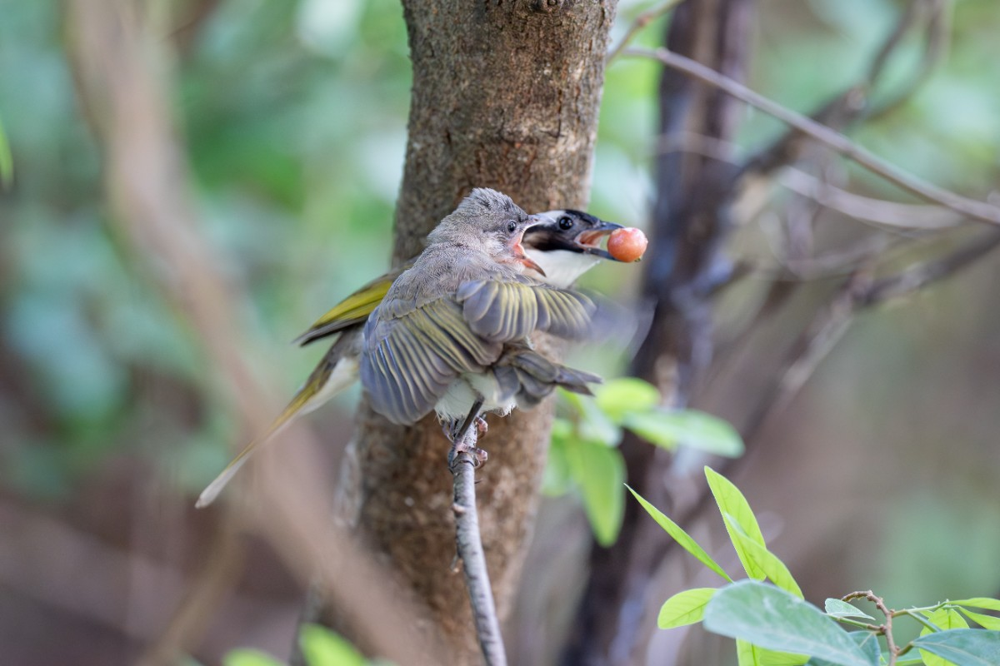

　　前陣子，處長突然把我找去聊天：「公司年底前可能會收掉。」

　　沒使用 [Chris Pratt .gif 大法](/mood/slang/#jpg)，是因為第一我覺得這需要看到原圖比較好笑，第二是和原圖比較後，我本人大概也沒這麼震驚。腦中的四格漫畫場景大概是：

　　~~「不是欸這個月才剛買 FE 100-400mm F4.5 GM OSS（某顆最新最潮的鏡頭）你現在跟我說這個」~~

　　好吧，就算知道公司會倒，鏡頭大概也還是會買，怪不了任何人。畢竟這裡最常說的一句話就是「計畫趕不上變化」，而這年頭連公司都開始跟上本 Blog 的宇宙大電波，這輩子也是有了。

　　塞翁失馬，焉知非福。剛好趁這機會，來聊聊關於工作的想法。

　　目前在公司雖然沒掛管理職，但大部分時間都是與處長合作中度過。直到年初處長卸下管理職變成顧問，我才又被分去做其他 Project。（前）處長原本沒有義務和我說公司的事，似乎是基於合作這麼久的道義提前告知公司未來可能走向。處長表示對他而言反正也到了退休年齡，公司倒了就順便退休，至於我，他建議了兩個做法：一是等公司真倒了，最差有勞基法保障的遣散費或非自願離職證明；二就是希望我多多考量職涯發展，「因為我還年輕」、「這公司就算沒倒基本也不會太有前途」，現在履歷可以更新，如果有好的機會隨時能跑。

　　結果聊著聊著，他話鋒一轉：「但就我觀察，你看起來不像是缺錢的人，來工作是做興趣交朋友的。」

　　哎呀，真是過獎了，但這段話只講對一半。如果現在的工作是做興趣，依照本 Blog 一卡車的興趣，「寫程式」或許連興趣都算不上。再來，雖然我的確「pretend」[^1]成一個不像缺錢的人，也不能說全對，因為以一般社會對照「成功人士」的標準，也不該覺得自己這麼「不缺錢」。

　　但我打算先跳過這部分的問題，來聊聊最近拍照的事。

　　（剛離巢沒多久的白頭翁幼鳥，急著吃媽媽嘴裡的果實 2026.06.23 by LQ7 ）

　　任何鳥類要能從蛋變成一隻幼雛，成功率其實不到八成。就算成功出生，真正的考驗才剛開始，萬一食物搶不過其他同梯，直接餓死在巢裡，萬一兄弟姊妹太多，巢太小被自己手足擠出巢直接登出也是常有的事，有些親鳥甚至會基於判斷，將看起來活不下去的親生小孩直接踢出巢外，增加其他隻的生存率。退一萬步，有吃到食物的小朋友也不見得沒事，因為也有食物中毒的風險，依稀記得去年大安公園的鳳頭蒼鷹育雛直播，最後兩隻小鷹都因食物中毒沒活下來，令人遺憾。

　　就算以上都平安度過，離巢階段是最危險的部分。網路上只要稍微搜尋，就會發現不少人在地上撿到綠繡眼或白頭翁雛鳥的影片。這些雛鳥剛學飛沒很穩，飛一飛有時會直接掉在地上，此時路邊隨便一隻外來種野貓野狗，就能直接讓牠從零開始的異世界生活。更別說前陣子的暴雨，那些毛都還沒長齊的菜鳥（物理），就是老天爺給牠門的震撼教育，而這樣的「教育」也會直接要了牠們的小命，一場暴雨下來，那些幼鳥存活率粗估從四至五成，降至不到兩成。

　　所以，大家能在路上看到蹦蹦跳跳的鳥類，都是這場大自然生存戰活下來的菁英。就算牠們沒有經歷過育雛階段就被窗殺或被天敵吃掉，也好過那些沒有機會變成成鳥的先烈。

　　以上的道理雖然不是第一次聽說，但看著鏡頭裡的鳥，讓我不由自主想像這些鳥每天的生活會是怎樣。

　　我是一隻鳥。當我還小時就只能盡力一直叫，希望父母多分我一顆果子或一塊肉，不要被隔壁同梯搶去。幸運漸漸長大後，希望學飛階段不要掉在地上被野貓野狗叼去，天氣變化太大時不要失溫，暴雨時不要被沖下排水孔。成年後每天煩惱下一隻蟲子下一顆果實在哪，跟其他鳥類爭地盤，找到另一半育雛，還要避免被天敵抄家[^2]。

　　趙傳有一首歌，歌詞是這樣的：

> 我是一隻小小小小鳥　想要飛呀飛　卻飛也飛不高
> 

　　「如果我是隻小鳥」這種小學作文題目，往往比想像中現實。一隻小鳥要能活過今天看到明天的太陽，就已經必須費盡全力，大概也沒空去想到底能飛多高這件事。

　　在[推坑魔術](/thinking/magicians/)一文我這樣寫過：

> 透過魔術，我才發現人類社會是這麼的有趣，也對人類文明保持著敬畏之心。這也是魔術對我而言「真正的秘密」。
> 

　　因為生態攝影而與大自然頻繁接觸後，我也漸漸開始對「自然生態」產生敬畏之心。更簡單的說，自然與文明的總和就是這世界上的一切，也總是值得敬畏。

　　回到不缺錢的問題。對我而言，不用煩惱下一餐的錢在哪，不用煩惱下一晚要睡在哪，錢夠能讓身為人類的「我」比「鳥」過得好，我認為就是「不缺錢」了。

　　但很可惜，人類終究是群居動物，大部分時候生活不見得是一個人說了算。自己的行為與決定，總會以不同方式影響身邊的人。例如畢業後剛開始做吉他教學時完全養不起自己，還得跟家裡繼續拿錢，現在自己的工作決定也會影響到另一半。以前看過日本節目專門訪問一人住在孤島的人，而當地的巡守也會固定時間登島拜訪，看人是不是還好好的。巡守表示只要島上還有住人就得來關心，這是他工作上的本分。

　　就算這麼極端的生活方式，在現代社會要不影響到他人實在太難了。

　　這個時候，終於可以聊聊這段打在「關於我」的話：

> 碩士畢業後第一份工作是~~非常反骨的~~木吉他教師，在音樂教室工作快兩年，但最終~~被現實擊垮後~~回來當了軟體工程師。因此興趣當飯吃這件事對我有深刻的體悟，有空再找機會細說。
> 

　　興趣當飯吃，首先得看有多少人願意為這興趣買單。舉例最近世界足球盃，全球幾億人願意買單，因此「足球員」理所當然能當作飯吃。如果換作《魔法氣泡》，雖然同樣有人將一生都奉獻給魔法氣泡，但因為買單的人少，就算是職業選手多半也只能「兼職」。

　　再來是興趣的具體程度。比如說因為興趣是與動物相處，所以想要從事動物相關的工作，但當一位獸醫也是與動物相處，每天跑山的生態調查員也是與動物相處，在木柵動物園工作也是與動物相處。如果分得更細一點，就算同樣在動物園工作，動物管理員、研究員、行政人員與技工內容型態也完全不同。

　　最後，就是自己的「本錢」。除了物質上的「金錢」本身，「實力」也是本錢的一部分，還有一項大家容易忽略的要素：「覺悟」。興趣能否當成職業，最終就是看自身的本錢，有人一輩子都在做虧錢的興趣，但因為「不缺錢」（物理上的，和我不同），所以也沒關係。有人則是實力強大到能當成先鋒開創一條嶄新的產業（如梅原大吾）也是非常合理，而有些人雖然都沒有，但有相當的「覺悟」，也未嘗不可。

　　講了這麼多，回頭來復盤那兩年在音樂教室工作的經驗吧。

　　首先，木吉他在流行音樂中已算相對熱門的樂器，願意花錢學習的人不少，但教學門檻也低，隨便一位（像我這樣的人）也能教，師資良莠不齊，或許和健身產業差不多。

　　經營一年左右學生漸漸穩定，差不多就十來個，也不全是學吉他，也有烏克莉莉和流行歌唱，當時生活方式就是下午教社團，晚上教課，總收入一個月大概就是兩萬元左右，恰好養活自己餓不死的程度。

　　當時終於從學生時代解脫，覺得「人生就是要做自己的興趣」，當時最大的興趣就是音樂，所以無論如何我都想試試看。但那個時候如果有這篇文章的話，或許可以幫助我想得更清楚一點。「做音樂」這三個字就跟「喜愛動物」所以想從事動物相關的產業差不多。

　　「拿木吉他當職業」這回事，駐唱歌手也是、吉他系 Youtuber 也是、演唱會一線樂手也是，製琴師也是，甚至在樂器行賣木吉他更是，但生活型態完全不一樣。或許現在看來，我很清楚我的木吉他技術就是沒有押尾光太郎、岸部真明或 Pierre Bensusan 那麼厲害，就算退一步當個彈唱歌手，比我厲害的大大們都跑去開 uber，我想也差不多理解這代表什麼意思。就如同那些古典樂科班的學生一樣，能在各大音樂廳定期表演終究是最厲害的那幾個，而大部分「一般人」的出路，就是「教學」。

　　真要說喜不喜歡教學，我應該算喜歡的那方。參加高中同學會時一群直男在那邊虧我的工作根本是以前高中生時期夢寐以求的職業（那時帶的五六個社團全是女校，所以整天就是教高中女生吉他），但心底總是有時會想，和我想像的「以音樂為生」不太一樣。

　　嚴格說來，這份工作比較像是「教學」，而不是「音樂」。大學研所時期當國文數學家教，和現在當吉他家教，似乎沒有太大區別。

　　於是，當時因為騎單車摔斷小指掌骨的時候，我藉機轉行了。

　　嘴巴上說因為手斷了沒法彈琴就沒法教沒有收入，現在想想，雖然我是比較幸運沒有學貸或養家經濟壓力的那群人（甚至起步時還能跟家裡拿錢），就算技術不夠混口飯吃，如果熬個幾年比氣長或許也大有可為，但說到底，我只是「覺悟」不夠而已。

　　覺悟是什麼呢？就像獵人裡的酷拉皮卡學習念能力時想要一條旅團成員絕對逃不掉的念能力鎖鏈。師父表示「只能對旅團用」這個代價有點弱時，酷拉皮卡說了，真正的代價是他的命。[^3]

　　我沒有「像我這樣的人從事音樂產業所要付出代價」的覺悟。說得更仔細一點，一開始投入行業時，只有「收入比較不穩定」的覺悟，但影響工作的，還包括實際工作的內容、生活型態、人際關係以及社會連結，這些都是覺悟與代價的一部分。例如想要成為英雄聯盟職業電競選手，先不論能不能加入一線戰隊與站上大舞台，實際作息、宿舍生活、人際關係與接觸的事物，都包含在代價之內。強如 Faker 貴為整個遊戲的門面，背後也是有相當的覺悟與代價，只是一般人習慣將它忽略而已。

　　回到開頭的話題，假設公司倒了，「下一份工作該不該繼續當個資訊工程師」對現在的我來說，居然成了個選項。我甚至在心底大膽假設，現在要當個全職攝影，只要覺悟夠大，或許也不是不行。但搞到最後，或許只是因為沉沒成本加上懶，雖然喜歡冒險，卻又更喜歡目前「理想的日常」，繼續當個「程式轉述員」[^4]也說不定。

　　最後，這篇似乎變成了變相的「星期四打羽球系列」，沒什麼結論。但總覺得這大概是最後的工作十字路口了，如果下份工作還是資訊工程師，看來這輩子到退休前就是資訊工程師了。雖然Ｐ人如我大概會等公司正式告知倒掉的那天再說，當然如果有什麼有趣的事情，例如可以去北海道俄羅斯海域挖螃蟹[^5]或者成為魔法少女[^6]的工作也歡迎介紹給我，或許也可以認真考慮看看 🫠

[^1]:「pretend」這詞原本想要打成中文，但總覺得「裝作」或者「假裝」都很難表達出精確的意思，我認為其中更有「想要成為」的意思。

[^2]: 都是真實發生過的事，包括被天敵抄家，有實況育雛的頻道，最後以巢內躺著一隻蛇作結 🥲

[^3]: 所以旅團打庫拉皮卡最簡單的解法就是「我宣布退團」 → 庫拉皮卡違反制約死亡 → 「我宣布入團」 🫠

[^4]: 以前本科都戲稱「程式打字員」，公司只要會打字的人就好，根本沒在「設計」。結果現在大 AI 時代，連打字都不用了，變成轉述需求的總機，真是「有趣」的時代Ｒ。

[^5]: 應該是《銀之匙》的劇情但可能敘述不是那麼精確。

[^6]: 根本不是少女，第一關就被刷掉 🤔