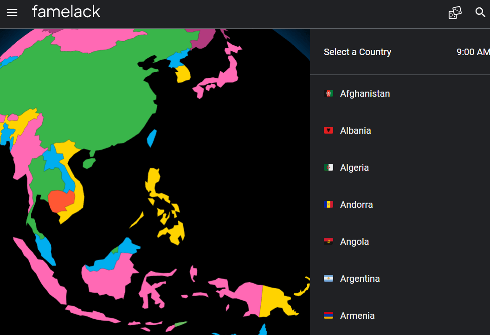

　　朋友某天突然丟了這個連結——「[看世界上的電視](https://famelack.com/)」，只要點擊地圖上或側邊連結的國家，就會列出該國家可以收看的頻道（如果是YOUTUBE來源會有YT圖案）。

　　很有趣欸！想要了解一個國家，除了親自走訪當地外，我想就是電視了。例如從黃金時段播的節目，廣告中的明星，就算一個字都聽不懂，也能用畫面感受該國的文化與氣息，所以在此推薦大家，可以用此網站開啟一場電視冒險 XD