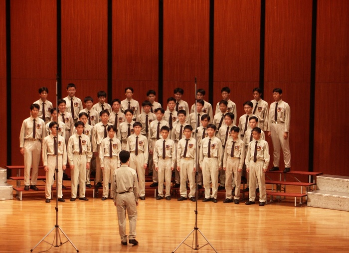

　　高中合唱團朋友日前接到專訪，表示想在訪談內提起當年合唱團的時光（也是他開始學習聲樂的起點），於是向大家索取當年的照片和影片。正想說到底誰還找得出這些幾百年前的東西時，其他團員居然直接將當初的成果展音檔及照片通通上傳了雲端。



　

　　原以為事隔多年音檔會不忍聽，但沒想到懷舊感終究還是壓過了羞恥感，發現「沒有想像中難聽」。然而照片就是真．羞恥了。卡其色制服搭配黑色領帶，加上胸前別了個超大團徽，以現在審美眼光簡直不忍直視。這可是當年引以為傲的「比賽戰鬥裝扮」，只要這樣搭配，就有種神聖不可侵犯之感，歌也會唱得特別好聽，出國比賽也能拿第一[^1]。

　　（查了一下~~看來學弟們終於發現審美上的問題~~，這套裝扮現在已經被換掉了）

　　說起高中合唱團，應該是這輩子到目前為止參加過最有向心力的「團體」，其中故事三天三夜說不完，也因為這樣，直至 2026 年的今日，居然還有朋友打算辦團聚。如果要為這三天三夜說不完的故事做個總結，那就是請去看《吹響吧！上低音號》[^2]，裡面音樂性社團所有的歡笑與淚水，都有著當年美好時光的影子。或許會如此喜歡這部動畫，某種層面也是投射了當初對於合唱團的情感也說不定。

　　最後，雖然有在演奏吉他和鋼琴，但如果偏激一點，我還是得說人聲終究是最好的樂器。無伴奏合唱雖然向來都不是音樂主流，卻是世界上最好的音樂。有任何機會，推薦大家去聽聽看，或許會有意想不到的發現。

[^1]: 事實上當年市賽雖然 85 分以上為特優，但當年成績 86.7 分，以一分之差輸給了 87.7 分的友校，無法參加全國大賽。

[^2]: [構成我的九部動畫](/mood/nine-anime-that-made-me/)內有提到一些關於本動畫的事。