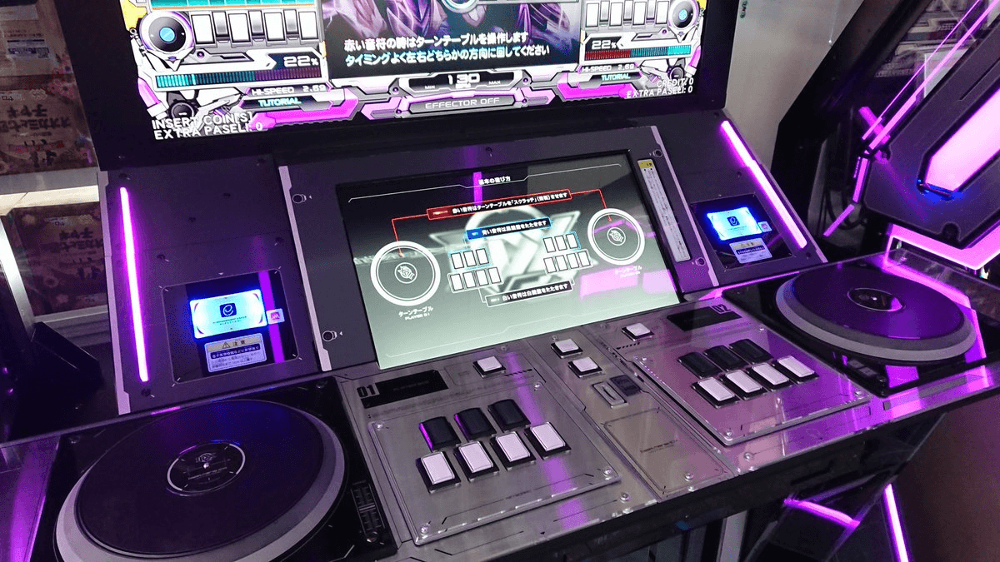

### 序

　　本次「[BlogBlog 同樂會 - 2026 年 6 月](https://www.yozblog.com/posts/music-and-memories/)」的主題「[音樂與記憶](https://www.yozblog.com/posts/music-and-memories)」，大概是目前同樂會糾結最久的主題了。正因為音樂佔據人生極大一部分，反而不知道該選擇哪段記憶來投稿，只好先觀摩已投稿的文章都在寫些什麼。

　　有人分享了自己創作的歌，讓我想到可以趁這次機會介紹[《そよ風に抱かれて》](https://open.spotify.com/album/155hGYwE9DG6WA5GU7LF8o)，順便把關於這首歌的二創小說移植到 Blog 上。也有人分享許多第一次聽的歌，想想或許也可以繼續新增「[30 天一天一首推曲](/music/shounen-ripples/)」系列。有人甚至將音樂與記憶聯繫到餐包，這也讓我想起最近某天買鹽酥雞時老闆店內重複放著張雨生的歌，或許也可以將這段記憶分享出來。

　　結果，就算看了許多精美投稿文章，也能仿效差不多的記憶，卻遲遲拿不定主意，因為這些記憶似乎都沒想像中有趣。

　　誰說 Blog 的文章一定要有趣？而且，把本質上可能是枯燥的事情寫得有趣不就是「作家」的魅力嗎？話是這麼說沒錯，但比起最初 Blog 文章致力於「想用作家文筆」寫文的人設，最近大概受到[李唯](https://wei-lee.me/)文筆影響，突然想讓自己的文章更「幽默風趣」，也更接近現實中的我一點。

　　人設已經崩了一次，這次可不能崩啊。（沒人在意）

　　等等，這樣說來文章主題範圍就得以縮小，只要找到那些看來幽默風趣的音樂記憶就好了。

　　嗯……。

　　好吧，本次同樂會分享的就是「音樂對我沒有任何幽默風趣的記憶」，謝謝大家，我們七月同樂會再見。

　　唉，連這種爛梗重複使用[^1]也幽默不起來，真可憐。

　　前言好像打得有點太長了。說到底，會有這段前言不只代表後面一定有本文，而是標題也早就打好了。也就是說，現在的我其實早就想好了這次同樂會的主題。

　　「所以，整個『序』根本就是在演？」

　　最討厭你這種直覺敏銳的小鬼了.jpg

　　好吧，以上大概是整篇文章最幽默的橋段。因為這次的同樂會主題的靈感，是看到了格友[劉昕](https://shuaixin.cc/about/)的 YT 影片 [越級挑戰！《竜と黒炎の姫君》](https://www.youtube.com/watch?v=vDsKdutD7ew)。聽著影片內幾乎聽不懂的太鼓專業術語，想起了一些事情。

　　沒錯，就算將「音樂」後面加了「遊戲」兩字，依舊佔據了我人生很大一部分。

　　我是個音樂遊戲玩家。所以藉由這次同樂會主題，我打算來分享「beatmaniaIIDX DP 十段」的回憶，這也是我「[BlogBlog 同樂會 - 2026 年 6 月](https://www.yozblog.com/posts/music-and-memories/)」的投稿文章。

### 前言

　　「有序了還有前言？！」

　　沒辦法。以前不管打辯論或研讀學術論文，偶爾也會遇到連標題也看不懂的窘境。所以我同樣也相信，「beatmania」、「IIDX」、「DP」、「十段」這幾個單詞一同打在標題上時，各位讀者看懂的機率大概也趨近於零，所以還是得稍微解釋一下。

　　《beatmania IIDX》（玩家們通常簡稱 IIDX 或 2DX，念作「兔低差」）是 KONAMI 於 1999 年推出的 DJ 模擬大型機台音樂遊戲，共有 7 個按鍵加上一個轉盤，為下落式音樂遊戲的始祖之一。每一年左右會出新的一代，雖然玩法相同，但有著不同的標題、主視覺風格以及新收錄的歌曲，2026 年的今天，已經更新到 33 代「Sparkle Shower」，框體長相如下圖。

　　進入遊戲後可以在兩種遊戲模式中切換，「Single Play（SP）」和「Double Play（DP）」。顧名思義，可以選擇只玩一邊（七個按鍵加轉盤），或者一次同時操控兩邊（14 顆按鍵加兩邊轉盤）。

　　DP 玩家比 SP 玩家少非常多，因為大部分玩家都是從 SP 起家，大概玩了一陣子才意識到有「DP」的玩法，會想特地嘗試的人少之又少。

　　「一邊玩得好好的（就夠難了）幹嘛玩兩邊？」

　　多數玩家大概都是這樣想，但 DP 玩家的想法的確不太一樣。玩 DP 的多半有兩種人，一種是 SP 登峰造極後開始找尋新的樂趣，另外一種是像我這種「明明可以同時玩兩邊幹嘛只玩一邊」的怪人。

　　而「十段」就和圍棋或鋼琴一樣，是遊戲附設的實力檢定。一次四首歌，能在血量不被扣完的情況下通過，則可以得到到該段位的成就。遊戲從「七級」開始一直到「一級」，再來是「初段」、「二段」……直到「十段」，再上去還有「中傳」和「皆傳」的認定。

　　音樂遊戲雖然是模擬演奏音樂的遊戲，但實際玩起來卻更像是運動。現實中的音樂多半必須考量到情感樂句表現，而音樂遊戲通常只管「節奏」，按到就是 1，按不到就是 0，跟射飛鏢或投籃差不多。這大概也是先前退坑的原因，但現在想想當時的我更像[《一百公尺》](https://www.youtube.com/watch?v=1ENmkryGOcw)動畫裡所描述的那樣，「不想被孤獨的困在那短短兩分鐘的歌曲賽道上」而已。

　　然而某天，日本工作的音樂遊戲好友難得回國，一同聚在了另一位朋友的家中，大家就在房間玩著 IIDX 家用版。

　　「欸，不回鍋一下？」

　　唉，人類的「自由意志」就是這麼虛無縹緲。

　　既然下定決心要回鍋，當時的我決定，這次要通過「段位認定十段」。

### IIDX DP 十段的回憶

　　（為求敘事流暢，本段不過多解釋遊戲專業術語，請多包涵）

　　回鍋幾個月後，我終於復健回九段的實力（退坑前的最高段位）。

　　物價通膨，段位也通膨。當時退坑前的九段守門員是 11星的「[Schlagwerk](https://www.youtube.com/watch?v=ckbKoPhVbEw)」，而 31 代 EPOLIS 最後一首居然是 12 星的「[Meissa](https://www.youtube.com/watch?v=gL6bIGmph9w)」。Meissa 的難點在中段爆發後血量剩下 30% 進尾段，這個藍白交互單手樓梯，不是「正在考九段的人」能按到的東西，考九段的人多半會[死在這七小節內](https://youtu.be/gL6bIGmph9w?si=OY4WdZ0nKu8CsHS_&t=70)（內有影片直接跳到該撥放處）。

 　　不過對我而言，就算回鍋時差點連八段都過不了，畢竟退坑前就是九段玩家，練了幾個月後也攻破 Meissa 最後難關，在 2024 年 4 月 25 日再度通過了九段。

　　IIDX 難度標示為整數，遊戲裡面最難的是 12 星， 十段開始，四首段位檢定的歌曲通通都是 12 星，但 12 星歌曲中難度差異也非常大，大概就跟同樣是奏鳴曲，Mozart Sonata op.16（K545）和 Beethoven Sonata op.29 不同級別一樣。於是，玩家自己將這些歌加上小數點，12星的曲子共分為 12.0 至 12.7，九段守門員 Meissa 難度是 12.0，而「十段」的四首曲子，多半在 12.3 。

　　然而，IIDX 31 代 EPOLIS 十段的曲子長怎樣呢？其他首歌或許不重要，但當時玩家討論的話題都在第二首「Xlo」上。

　　簡單翻譯幾段內容：

　　「前作十段合格者。這次以 60-24-12-30（各關的血量）過關了……但話說回來，為什麼十段裡面會出現 Xlo 啊？」

　　「之前擺在中傳的 Xlo 居然在第二首降臨，真的是史上最強十段。」

　　「如果是即將挑戰中傳的人，會覺得 Xlo 其實也還好……但叫要升十段的人打這個，未免太扯了。」

　　「如果 Xlo 撐得過去其他歌就沒問題了，大概是這種感覺。」

　　「我打 Xlo 噴的 BP（Bad/Poor 數）竟然比打中傳還要多，笑死。這真的是給十段打的譜嗎？」

　　沒錯，十段難度也通膨了。四年前 27 代 HEROIC VERSE 的中傳曲目，下放到了十段。這首歌非官方難度妥妥的 12.4，作曲者是大名鼎鼎的 [sasakure.UK](https://www.youtube.com/channel/UClkc2M0xPFhoOzzHlgZDMfw)[^3]，他寫的遊戲譜面也是出了名的~~吉掰~~困難。

　　一起來聽聽 Xlo 這首歌吧。



　

　　感謝片中 Ranker 示範這首歌正確遊玩方式。但對於即將挑戰十段的人，整首歌就是完全不知道在玩什麼，而且對我來說當時最要命的，還是 59 小節（上面影片 1:23）這段看不懂的四連音：

　　這段節奏無論在腦內演練了多少次，手型就是擺不出來，被前面龐大物量[^4]折磨後僅存的血量就在這邊消失殆盡。

　　當時的實力差不多就是能開始打 12.1、12.2 的曲子，現在檢討，物量程度沒有上去，就是沒辦法挑戰 Xlo。當時以為上九段後估計練個半年，就可以十段，但截至 2024 年末換代，終究無法突破 Xlo 的魔掌。

　　然後，就迎來了 32 代「Pinky Crush」。

　　這代的標題當初還在朋友圈被調侃了一下，因為有一位 IIDX DP 非常厲害的朋友（世界百大 DJ）打機打到小指肌腱斷裂還跑去開刀，當時新作標題一出，大家都笑「Pinky Crush」根本是在針對他。我們並不是以遊戲的心情在玩戰鬥陀螺.jpg，IIDX DP 如是。這是個危險的遊戲，稍有不慎小指就會 Crush，請各位謹慎遊玩。

　　由於每代的段位歌曲有可能會更動，因此當時立刻迎來了一個好消息—— Xlo 沒有出現在 Pinky Crush 的十段，被拿掉了。

　　正想著 Konami 居然這麼有良心，也知道 Xlo 擺在十段太難的時候：

　　以前就出現過的十段曲「LASER CRUSTER」颯爽回歸，取代了 Xlo 的位置，擺在了第二首歌。

　　這首老歌一重出江湖，那些皆傳朋友就紛紛警告我，這首歌盡量少玩一點，如果搞出「手癖」就再也考不了十段了。

　　「手癖」——當一首超出程度的歌玩了太久，大腦會對特定的譜型排列產生錯誤的肌肉記憶，導致譜一來的時候腦袋還沒反應過來，手指就開始自動按錯，也是所有音樂遊戲玩家的惡夢。

　　因此，有些歌如果一直重複著某些同樣的運指結構，就特別容易出「癖」。

　　LASER CRUSTER 開頭短短的八小節，已經把所有難點講完了。這看起來像是樓梯音階卻又零碎的東西，從頭到尾一直重複，而且左右手都要會打。想當然要挑戰十段的人是無法精細處理這種困難樓梯，只能按個大概。

　　但就是這個「按個大概」，會讓人越按越不懂，越按越不知道自己現在到底在打哪個 note，導致整段跑拍。

　　音樂遊戲玩了這麼久，那些「據說容易出手癖」的歌，我一次也沒有遇過。因此當時的我根本不去在意這件事，想說就算出了手癖，只要解譜再更強一點，根本不是問題。

　　人不做死就不會死，當我發現開始出手癖的時候，已經來不及了。

　　當時最誇張的情況，是第一首歌打完 100% 血量進 LASER CRUSTER，依舊沒進主歌前血量就歸零。朋友見狀紛紛表示沒救，說只能放一兩個月再回來打看看，不然就等下一代會不會換歌還比較實際。

　　當時的我已經開始 Easy Clear 一些 12.3 的歌，物量是史上最巔峰的時候，但依舊拿這首歌一點辦法也沒有。最後我決定依照朋友的建議，直接放置一個多月後，回到了機台上，投下了 30 元[^5]。

　　當我發現進入 LASER CRUSTER 後，手指自動動了起來，心想就是這次了。果然，只要這段奇怪的樓梯能按個大概，整首歌血量就會在 10~30% 之間跳動，最後的片手樓梯出來，我就知道這會是第一次突破 LASER CRUSTER 不知道心魔多久了的歌。

　　但遊戲還沒結束，段位認定十段後面還有兩首歌。第三首歌「烽火連天の刃」，譜面非常難理解，而這首歌容易讓人一直覺得「很慢」，但其實是首 BPM 190 的歌。一位曾經是中傳但鮮少遊玩的朋友，想要考回十段時居然打不過這首，最後也險些出癖，此時我才發現十段分別擺了「雷射」和「烽火連天」，就是針對兩種不同面向的玩家。會打樓梯的玩家，可能就沒那麼擅長處理精細的物量著地譜。

　　（圖為烽火連天的刃我認為最難的八小節）

　　「烽火連天の刃」最難關就是在尾段的長條帶物量，一個沒看準大概就會全面崩盤。但這種譜相較於 LASER CRUSTER 是我更擅長的譜面，雖然血量看起來危險，最後還是以血量 10% 進入了十段最後的守門員「Godspeed」。

　　不知道為什麼，Godspeed 明明 BPM 165，體感卻比烽火連天の刃來得快許多。皆傳朋友攻略指導就是「Godspeed 比想像中的來得慢很多，不要按太快」，這句話真的起到非常關鍵作用。整首歌的最難點就是兩個橋段，開頭有一個物量爆發的地方，如果沒撐住就直接關門。撐住之後中間地段度過，最後迎來的是橋段接最後一次主旋律的鬼門：

　　撐過了 53 ~ 56 小節的最難過門後，進最後主歌單手的物量太大，只能看多少按多少。這段攻略要點是視譜不要被較難的阿邊吸引走一次還是得同時看兩邊，組合鍵也要仔細看，最後如果能聽到尾奏，那就代表過了，恭喜十段。

　　印象中，進入第四首歌 Godspeed 沒多久，手就開始出汗。可能是沒熱身完全，或是第一次在段位血量打 Godspeed 的緊張感，我早就意識到雙手已僵硬到不聽使喚。

　　有時候我會想，音樂遊戲玩家究竟一開始是如何成為音樂遊戲玩家的呢？

　　當時的我，應該是大學和朋友一起去大型電玩間，看到一台非常顯眼的跳舞機擺在門口，覺得有趣就上去玩了一下。之後漸漸養成了習慣，半夜有空就和一群朋友騎著半小時車程的機車，去電玩場玩打鼓機和跳舞機。

　　或許一開始都是覺得「演奏音樂的遊戲很有趣」所以入坑。然後呢？

　　有在玩 IIDX 的職業音樂人，說真的還不少[^3]。如果說不會音樂的人靠著「音樂遊戲」體驗到演奏音樂的樂趣，都能把音樂當職業的人，玩「音樂遊戲」又能得到什麼？假設戰鬥機飛行員每天開著 F-16 戰機，那麼他會喜歡玩「F-16 飛行模擬遊戲」嗎？

　　回想起音樂遊戲人生，我也不知道自己在遊戲中得到了什麼，或許遊戲外得到的，比遊戲內還多上許多。

　　但有張圖是這樣說的：

　　音樂遊戲玩家群組最常出現的形容詞，叫做「好玩遊戲」。

　　因為是音樂遊戲玩家所以覺得音樂遊戲「好玩」，實在是再合理不過了。但很抱歉，這裡的「好玩遊戲」是在反諷，而不是字面上的意思。

　　順帶一提還有另外一句常用用語：「誰愛玩誰玩。」

　　音樂遊戲玩到最後，每首上位歌曲都像在整人。但玩家們總是一邊喊著誰愛玩誰玩，一邊想盡辦法攻略歌曲。

　　《葬送的芙莉蓮》中，費倫曾[說過這句話](https://yangbear.bearblog.dev/3494/)：

> 必死に積み上げてきたものは、決して裏切りません
> 

　　「拼命累積起來的東西，絕對不會背叛自己。」

　　每天被自己累積起來的東西背叛，就是音樂遊戲玩家的日常。然而，玩家本身或許根本就不在乎「背叛」，因為過度練習而出手癖的歌，就想辦法把錯誤的肌肉記憶忘掉後練回來。這次沒過，這次沒接，下次再試試看。那些看起來的「背叛」，或許更多玩家只是把它當成累積的一部分而已。

　　十段這四首段位歌曲，都不知道練習多少次了。家裡每天重複撥放著 Godspeed，連太太都有辦法哼出整首歌旋律的程度。

　　就算手已經累了，但在精神最好的時候、睡眠不足的時候、肌肉痠痛的時候、累得半死的時候我都打過這首歌，我對 Godspeed 的每個難關都瞭若指掌，我也對自己在各種狀態時該如何打這首歌瞭若指掌。

　　當時腦中只有一個念頭：「LASER CRUSTER 都過了，現在的我，是不可能死在 Godspeed 手上。」

　　事實並沒有想像中如此雲淡風輕，另一位玩家在機台後面看得膽戰心驚，事後和我說，關鍵地段我的血量永遠在 6% 至 10% 游移，不知道是怎麼撐下來的。

　　啊，如果當時的我有先想到費倫的這段話，那就可以耍帥了。

　　「拼命累積起來的東西，絕對不會背叛自己。」

　　2025 年 3 月 30 日，段為認定十段達成。

　　唯一可惜的是當時臨時起意上機台考，所以沒有錄影。為求臨場感，以下是一位玩家挑戰十段的影片，除了 LASER CRUSTER 打得比我好很多外，其他首歌的表現和每個剛過十段玩家的情況差不多，我想可以作為代餐，一起感受一下 IIDX DP 段位認定十段的現場氣氛。



　

　　「這麼認真玩音樂遊戲，到底獲得了什麼？」

　　這問題我思考了不下百次，但直至今日還是沒有答案。大部分時候，我甚至說不出「IIDX 真的很好玩」，或者「音樂遊戲真的很好玩」這種話。如果新手想嘗試 IIDX 這遊戲，現在的我只會回「瘋了嗎」，就跟當時皆傳朋友知道我回九段開始在 12.1、12.2 難度歌曲掙扎，走他們那些皆傳以前走過的路，說了句「一想到 LQ 要開始練這些白癡歌就覺得這遊戲到底有什麼毛病」之類的話。

　　是啊，音樂遊戲玩家或許都是多巴胺的奴隸，但我想人生就是這樣。George Mallory [^6]被問到為什麼想要爬聖母峰的時候，他說：「因為山就在那裡。」

　　為什麼想過 IIDX DP 十段？大概也是因為「十段就在那裡」吧。

### 後記

　　上上個禮拜，我把家裡用來打 IIDX 的電視、控制器、音響、甚至玩遊戲用的電腦全部賣掉了。

　　這也代表這篇文章大概就是我 IIDX DP 最後的回憶。現在的我專注在其他事情上，所以從去年 10 月開始，我就沒有認真練習這遊戲，也果斷放棄了繼續挑戰中傳甚至皆傳的機會。

　　「當作休閒玩家玩玩不好嗎？」

　　有些遊戲和運動可以，但 IIDX 不行。這就是個當你說要玩，你就是得把當天精神最好的時候排給 IIDX，排好課表，然後從熱身開始打個兩三小時最後氣力放盡，然後去睡覺，期待明天睡醒後進步的遊戲。所以平日如果要玩，由於平日下班後的精神狀態練習效率太差，所以那個時候，下班回家第一件事情就是睡覺。

　　其他的音樂遊戲如 DDR 跳舞機我反而能接受當個休閒玩家，但 IIDX 感情上不知為何無法接受。如果無法認真練習，不如退役還比較輕鬆。

　　朋友來我家搬電視，看著空蕩蕩的特製角鋼桌子，說了句「好像有點感傷」，我笑著回：「還好，人生嘛，就是這樣入坑又退坑，有其他更想做的事情就是得放棄些原本在做的事情。」

　　當時的我的確沒有感到任何感傷。但打這篇文章的時候，為了找資料看著那些譜面，聽著很久沒聽卻耳熟能詳的曲子，突然有點鼻酸。

　　每次同樂會的主題多半都藉由主題分享生活與價值觀，但這次或許是第一次沒認真想要傳達什麼理念，只是幫自己的音樂遊戲回憶辦場葬禮而已。

　　說是葬禮好像有點太嚴肅，只好前後呼應，用劉昕的[這番話](https://shuaixin.cc/hello/index.html#2025-%E9%83%A8%E8%90%BD%E6%A0%BC%E5%B0%8E%E8%A6%BD)做為結尾：

> 過去的一年是一個，把從前的一個個的豪情壯志，一個個地輕輕放下的一年。每放下一個，都會揪心很久。但是看到那些包袱被放在地上以後的樣子，又會覺得它們十分可愛。講真的，你們一定看不懂這份心情：一邊覺得揪心，一邊覺得可愛。
> 

　　唉，怎麼可能不懂呢。IIDX DP 皆傳就是從前的豪情壯志，而十段就是現在被放在地上的包袱。

　　雖然我也只是個十段的燕雀，但這個包袱或許真的既揪心，又可愛吧。

[^1]: 基於文學正統性（？）原本想打「爛哏重複使用」，但「爛梗重複使用」是某個知名英雄聯盟主播的 ID，於是從善如流。（意味不明）

[^2]: 貨真價實的鍵盤樂器音樂遊戲，就算現在[看影片](https://www.youtube.com/watch?v=3mBS4WqCGw8)還是會笑出來，收掉的原因除了太難沒人玩之外，我想就是太難沒人玩了。

[^3]: 如果有人知道 sasakure.uk 這位作曲者，這邊分享個豆知識，就是 sasakure.uk 也有玩 IIDX，而且是 SP DP 雙皆傳，知名音樂遊戲作曲者 [ICE](https://www.facebook.com/iceloki/?locale=zh_TW) 同樣也是雙皆傳。

[^4]: 物量：在極短時間內，密集度極高的音符（Notes）總量。單位時間內越多顆 notes 的歌曲，物量越高。

[^5]: IIDX 大型機台有兩種框體，一種是新框，最便宜的模式一次 40 元，我則是習慣玩舊框，也比較便宜，一次 30 元。

[^6]: George Herbert Leigh Mallory，英格蘭探險家，在嘗試攀登西藏的聖母峰途中喪生。（[維基百科](https://zh.wikipedia.org/zh-tw/%E4%B9%94%E6%B2%BB%C2%B7%E9%A9%AC%E6%B4%9B%E9%87%8C)）