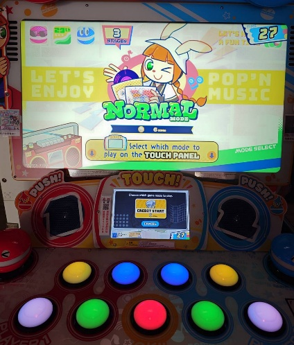
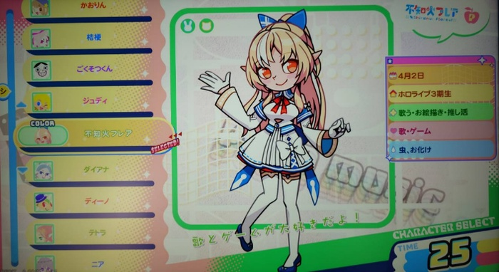
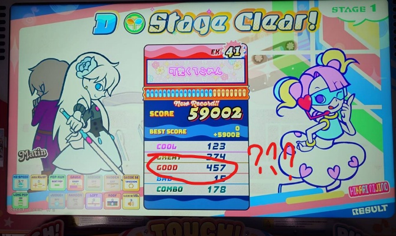
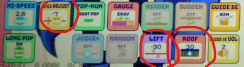
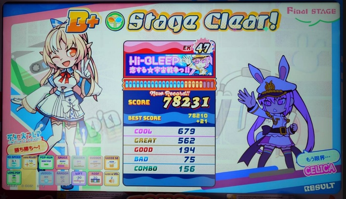
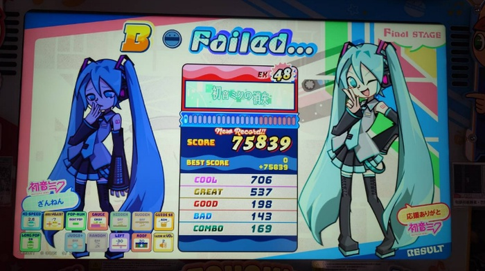

　　（前情提要：[《Pop’n Music》](/music/popn-music/)）

　　真沒想到這還真能有續。最近和朋友約吃午餐，好死不死（？）餐廳的對面就是以前常去的大型電玩間，於是來都來了，當然還是要進去一下，結果就發現這間店居然也進了 Pop’n Music 的最新框體：

（新框體中間多了個螢幕，一定得點螢幕上的「CREDIT START」才進得去）

　　來都來了（again），只好來開個卡[^1]嘗鮮，一進遊戲當然是要先看看到底收了什麼新角色[^2]，沒想到新角色居然有「不知火フレア」[^3]！

　　「欸欸欸有不知火フレア能選欸！」

　　向同行朋友告知這驚愕的消息，沒想到朋友面不改色回答：

　　「那你知道她其實 popn 很強嗎，所以才有合作」

　　「……真假啦」

　　雖然以前某陣子多少有在 Follow Hololive，二三期生那附近還是略知一二，但這還真是八月截至目前最令人震驚的冷知識。不知火フレア今年誕生季還用很誇張的 3D 技術實況打 popn，真的太扯了：



　

　　雖然如同星街彗星的 Puyo Tetris 玩不贏我（大概），不知火フレア的 popn 也是（大概），但才看不知火フレア打了五秒就能知道她絕對稱得上 popn 核心玩家（絕對比我核心），而且最喜歡的歌還是 wac 的「o†o」：



　

　　wac 是誰呢，沒錯，就是[《少年リップルズ》](/music/shounen-ripples/)的作曲者，不知火フレア真是有品味（咦）。

　　可以想像フレア能作為角色被收錄到遊戲裡面，作為遊玩多年的玩家本人，應該會非常高興，大概就跟憑一己之力拿到卡普空冠軍，讓大神ミオ的帽Ｔ再販的傳奇快打玩家 KAGAMI 一樣[^5]。

　　好吧離題了，總之先玩首歌復健一下，結果立刻發現不對勁，我抓不到新框體的準度：

　　研究後才發現，新框體的螢幕比較大，因此還是得調整一下判定線的位置以及時間：

　　（最後大概是這樣，判定 -7／LIFT -30／ROOF 30，整個畫面會比較窄一點，有時候螢幕太大對解譜反而有害，例如 IIDX DP 很多玩家還是習慣打舊框，只因為螢幕比較小）

　　搞了一陣後終於能玩了，popn 果然是好玩遊戲（在還沒玩到難玩的部分之前）：

　　還能過宇宙戰爭是真沒想到（雖然開了easy），新框體螢幕好滑順，按鍵好好打，這麼完美的 Buff，該不會 48 等的歌也能直接拚拚看：

　　好吧，當我沒說，誰愛玩誰玩，該回家惹🫠

[^1]: KONAMI 系遊戲使用 e-pass 卡片記錄遊戲成績，玩家稱遊玩從沒玩過的新一代版本或框體為「開卡」。

[^2]: Pop’n Music 的最大特色，就是遊戲裡面可以選擇一隻（無任何遊戲作用）的角色，進遊戲後會在左邊跳舞（？），很可愛。

[^3]: Hololive 三期生。

[^4]: 同樣也是 Little Rock Overture 的作曲者，就是 EO 大大在[這裡](https://eoiiio.bearblog.dev/1916/)提過的那首歌。

[^5]: [「能想像自己拿世界冠軍，卻沒想像自己能上早安MIO」](https://www.youtube.com/watch?v=FHshyNd7CSw)的 UMA 選手。順帶一提如果沒記錯他以前叫 KAGAMI 但因為太撞名了後來改叫 UMA。