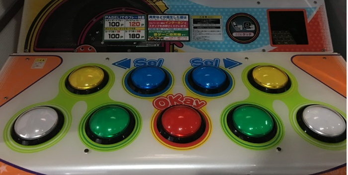
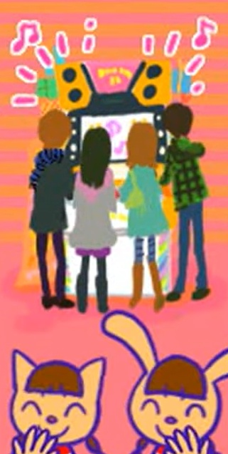
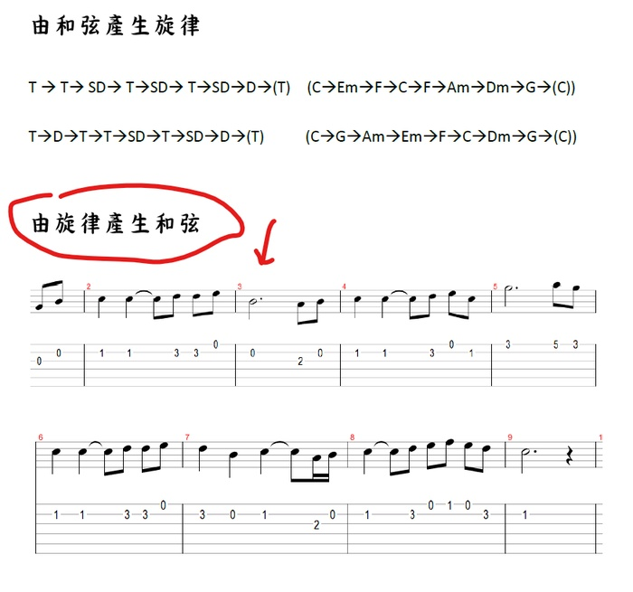

　　格友EO大大先前在看佛經，而最近在下圍棋，和我的興趣[^1]有著若即若離的宇宙大電波重疊，沒想到最新的一篇文章，居然在講[去玩了 Pop’n Music](https://eoiiio.bearblog.dev/popn-music/) 的事……🤔

　　事以自此（？），不得不來聊聊《ポップンミュージック》這款遊戲了。

　　首先，當然得先聊一下關於《Pop’n Music》的冷知識，延續一下七月同樂會的電波。當時 KONAMI 為了將 Hardcore 的 IIDX玩家[^2]區分出來，因此打算設計一款 Party 向的音樂遊戲，內容有著可愛的畫風，無論男女老少都可以在當中享受音樂遊戲機台的樂趣。

　　於是，《Pop’n Music》（以下簡稱 popn）就這樣誕生了。直到十幾代前，進遊戲第一個要選擇的，就是要「一個人玩」還是「大家一起玩」，如果選擇一個人玩，那麼使用的只有中間五顆按鈕，選擇「大家一起玩」用的才是全部九顆按鈕。

　　「蛤？為什麼是九顆？這樣如果兩人一起玩，無法好好分配誰要按哪些鍵欸。」

　　沒錯，正因為無法好好分配，如果是情侶一起玩，兩人或許會為了同時去按中間那顆紅色按鈕，導致兩隻手「不小心」碰在一起。

　　使用單數按鍵這件事，是遊戲設計者故意的！

　　先不論這遊戲設計策略是否真有讓眾多遊玩的情侶感情升溫，但當時的確因可愛的設計理念和曲風，成為女性玩家最多的一款 KONAMI 系音樂遊戲[^3]。時至今日，先前日本 Konami 音樂遊戲全國大賽，popn 也是唯一有「女性部門決勝大會」的機台[^4]。



　

　　但各位大概也知道，就跟 IIDX DP[^2]一樣原本是設計給兩人遊玩的模式，自從~~沒有朋友可以一起玩的單身宅宅~~越來越多玩家發現就算是九鍵一個人也能玩的時候，KONAMI 也從善如流，從某代開始把「多人一起玩」的選擇拿掉了。現在雖然同樣貴為「Party Game」，但預設上就是九鍵遊玩，而且歌曲也越來越難，越來越不「Party」，我想這就是大型音樂遊戲機台的最終宿命吧。

　　然而，撇開遊戲難度，裡面的確有許多非常棒的曲子，不如說 KONAMI 歷史上作曲家們的畢生功力都在裡面了。然而，真要選一首 pop'n 機台內印象最深刻的歌，我或許不會選 wac 的曲子[^5]，而是選這首：



　

　　這首歌的歌名叫做《Have a good dream》，是《pop'n music 16 PARTY♪》16 代的最後一首解禁曲目，曲中原本的該放遊戲角色的位置，變成了 Ending Roll 的 mv，記錄著歷代 popn 成長與改變。

　　雖然我也不是從一代就開始遊玩的玩家，但每次看到這首歌的 mv 總會流下眼淚。

　　先前在 IIDX 文章中[^2]問自己「這麼認真玩音樂遊戲，到底獲得了什麼」，驀然回首，答案或許就在這動畫裡面吧。

　　（mv 內就真的是這樣畫，證明上面整段冷知識我沒有騙人）

（Hello! We present this game to the people who loves music and games. Here come happy funny pop’n staffs! Let’s make it together!）

　　當時甚至拿了這首歌的旋律當作高中生的作曲教材：

（希望學生聽到主旋律後能自己配出喜歡的和弦）

　　最後，EO 的[文章內](https://eoiiio.bearblog.dev/popn-music/)提到了遊戲機台分布的事：

> 我再查了這個遊戲機在台灣的分布情況，厲害了，全台灣17台。哇塞，比日本進口的壓縮機還要稀少欸，這樣玩家要怎麼玩啊？
> 

　　17台！！！其實我不用查就能猜到，這數量是台灣有史以來 popn 機台數量最多的一次，而且要歸功於 KONAMI 終於換了 POPN 那破舊的框體設計，現在的新框有著最新最舒適的螢幕，店家也願意引進的原故。如果是當年的「盛況」，搞不好連七台都沒有，真是可怕。

　　無論如何，希望 EO大大能在 POPN 這款音樂遊戲找到屬於自己的樂趣😊

[^1]: 嚴格說來看佛經不算我的興趣，而且佛經要自己看懂實在非常困難（[EO大大在這篇](https://eoiiio.bearblog.dev/531/)已經詳細說明），但某陣子有把聖嚴法師的講經影片幾乎看完一輪。有專業人士解經方便很多，當然前提是那位專業人士必須「可信」，牽扯到宗教的任何事，個人誠心建議小心為上，不可不慎。

[^2]: 關於 IIDX 我寫了篇文章，可以來[這裡看看](/music/iidx-dp-10-dan/)。

[^3]: 當然以台灣現況，女性玩家最多的應該是 Maimai，再來可能是太鼓，但以上兩者都不是 Konami 出的音樂遊戲。

[^4]: 別小瞧女性部門，每個遊戲實力都跟鬼一樣，她們同樣不是以遊戲的心態在玩Popn Music.jpg。

[^5]: 關於 wac 這位作曲家我同樣寫了篇文章提過，可以[看這裡](/music/shounen-ripples/)。題外話，這首歌同樣也能在 [pop’n music 裡面玩到](https://www.youtube.com/watch?v=3x0BvSL0Vqk)喔！