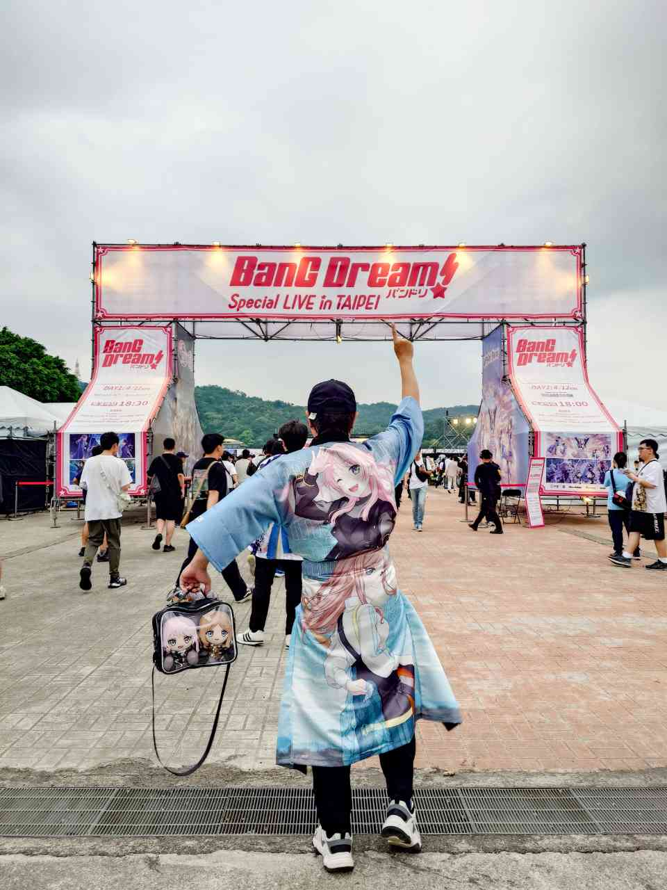

　　在這場演唱會之前，偶爾還是會想起那段剛下載好邦邦手遊的青春時光。

　　「摩卡講話好慢好好笑」

　　「HHW的劇情太扯了吧」

　　「不要再選ふわふわ時間了」（之後變成天下 A to Z ）

　　「Diable又斷滑條可惡這場就我沒接」（其實是在說ティアドロップス）

　　當時沒參加其他社群，只和三五好友玩玩遊戲並互相吐槽。實體兩團之中朋友們都比較喜歡 Roselia，只有我喜歡 Poppin'Party，大家都嫌愛美的聲音為了裝角色聲音導致太尖，還順便一同嫌棄動畫內的香澄個性令人煩躁。

　　是又怎樣？愛美臉上那時時刻刻保持的笑容，對我來說就是「バンドリの顔」。就算喜歡的歌各樂團都能說出個幾首，但真要說三次元演唱會氣氛最能感染我的，終究是 Poppin'Party。直到今天真要說起邦邦最喜歡的歌曲，我還是會毫不猶豫地說就是那聽起來略嫌幼稚的《Yes! BanG_Dream!》，無論是旋律還是歌詞都乘載著青春的夢想，也是我對 Poppin'Party 五人的完美想像。

　　但就和《玩具總動員３》裡面的主角一樣，人總會長大，總會追尋新的事物，某天不知不覺中就會和以前的喜好告別。當打開遊戲只為領每日的石頭，朋友也紛紛換了遊戲，最後一次看的老團現場表演已經是疫情前 Roselia x RAS 現地，好幾年過去大家都有了新的興趣，就算是邦邦，武士道總能搞出更多花樣，組更多新團讓大家追。

　　所以，當沒有買到 2/28 十周年的票，甚至沒抽到 Roselia 的台灣公演的時候，我也想著「那就算了」，沒有太多波瀾。

　　長江後浪推前浪。當新作遊戲《BanG Dream! Our Notes》公布的那刻，只覺得「這大概也是沒辦法的事」。2026年的今天，愛音爽世感情這麼美好（？）的同時，KasuAri、MisaKoko、YukiLisa 不知不覺也成為了那些曾經。當類似的徽章在二手商店，愛音要價 450 元（還隔天就被買走）而香澄只要 80 元的時候，雖然不想承認，但心中總會默想，時代就是會變。

　　所以當 Poppin'Party 和 Roselia 突然就確定在台灣一同舉辦演唱會，就算站在 VIP A6 的區域，還是沒有任何實感。一邊暗自慶幸人潮沒有昨天多的同時，忐忑不安的心情也逐漸放大。

　　Poppin'Party 從來沒有在台灣開過演唱會，我這輩子也沒在現場看過她們的演出。

　　「我真的還喜歡 Poppin'Party 嗎？」

　　無論電影、動漫、音樂，總有些以前非常喜歡，長大後再度回味時才發現平平無奇的藝術作品。隨著年齡經驗的增長，聽的歌曲樂團越來越多，心底某處深怕那些美好回憶，終究是年輕時的夢幻泡影。嘴上和別人講講很容易：「Poppin'Party 感情永遠是這麼好」、「超喜歡她們曲子的歌詞」、「愛美的笑容就是這麼無敵」。

　　但萬一真的看到 Poppin'Party 現場後，才發現已經沒有想像中喜歡，怎麼辦？

　　如果有人懷疑我喜歡愛音和爽世的程度，只要把寫好加起來超過２２萬字的同人小說攤在桌上就好。但， Poppin'Party ？手邊的周邊只有幾個小型吊飾外，甚至連新歌都沒在聽，到底能有多喜歡？

　　或許只是年輕時的夢幻泡影吧，或許。

　　「不要想這麼多，想想開心的事就好。例如《Yes! BanG_Dream!》這首歌到底會擺在什麼時候唱，是第一首還是最後一首？至少不用擔心喜歡的歌到底會不會出現，只需要耐心等待就好，屆時那些心底的疑問自然會解開。」

　　我盯著舞台旁的夕陽發呆，試圖讓自己別想太多。這年頭心情沒太大起伏的演唱會，難道少看了嗎？就算是圓個年輕時的夢，也算值回票價了吧。

　　咦？

　　

　　「さあ、飛びだそう！明日のドアノックして、解き放つ無敵で最強のうた！」

　　「In the name of BanGDream！（BanG_Dream!）Yes! BanG_Dream!（BanG_Dream!）」

　　

　　觀眾何時開始歡呼，舞台燈何時暗了下來，愛美什麼時候出現在舞台中央開始唱歌，旁邊還站了個 Aiai，已無法回憶。

　　愛美和 Aiai 在台上一同唱著我最喜歡的歌，還有  Poppin'Party 的大家。

　　我甚至沒有意識到，眼淚是什麼時候開始不停地流。

　　直到愛美唱出第一個字之前，我下意識拒絕相信這是真的等了十年的演唱會，一直抱持著「沒看到也沒關係」的心態。真正讓我清醒的，是和大家一起喊「５、４、３、２、１  BanG_Dream! Let's go!」的時候，是看到五人那記憶中笑容的時候，是大塚紗英間奏時彈著那不能再熟的 Solo 的時候。

　　Poppin'Party 和 Roselia 真的來了，就在我面前。愛美帶著那十年如一日的笑容，和 Aiai 一起。

　　「就算低著頭向前走，只要拾起星星的碎片，一定能與你相遇。」

　　我大概算是一個愛哭的人。看到感動的情節會哭，只用撥放器聽歌也會哭，上次和朋友在 KTV 唱歌，就算包廂內有只見過兩三次面的人，唱到乃木坂的《何度目の青空か？》也突然哭到唱不下去。但就算這樣，這輩子看了不下百場（也演了幾十場）的大大小小演唱會，似乎一次也沒有哭過。就算 Mr. Children 唱了《終わりなき旅》、鬍子男唱了《Same Blue》、乃木坂第一次來台灣開演唱會時在台上跳了《インフルエンサー》，這些最喜歡的歌就在面前演奏，除了深受感動離場時心滿意足外，也沒有哭過。

　　除了此時此刻。現在。

　　「相信著總有一天會相遇的夢，總有心跳不已的時候，只能把這快滿出來思念，悄悄藏在心底。」

　　是啊。現在回想起當時的眼淚，並不是單純聽到了最喜歡的那首歌，而是那藏在心底將近十年的思念，得到了回應。

　　就算 2/28 沒有買到十周年的票，心底還是做著總有一天會相遇的夢。

　　整場演唱會，都像是做夢一樣。好久不見高音卻越唱越好的 Aiai，那些曾以為已經聽到膩《BLACK SHOUT》和《ONENESS》，都變成了心中獨一無二的旋律。《Requiem for Fate》對我來說完全沒聽過的新歌，看到工藤晴香流暢的 Riff，也讓人會心一笑。

　　工藤晴香已經不是那個前奏要過度簡化到連 Aiai 都會忍不住笑出來的小妹妹（？）了。無論是現在還是未來的她，都是演奏實力最接近「冰川紗夜」的時候。

　　或許這一刻，才是 Roselia 真正的完全體也說不定。

　　無論是那些記憶中的角色台詞，記憶中 Aiai 在舞台上刻意的 OOC，記憶中 Roselia MC的綜藝，記憶中兩團該會出現的互動，所有的美好都在今天實現了。這輩子記憶中所有演唱會的錄影，愛美從來沒有唱得這麼好過，超越了任何錄音和 Live 版本。直到《Kizuna Music》時我才想到，或許這場 Live 各方面都是個奇蹟，原來不只有我期待著這場表演，底下的所有粉絲也都一同期待著。

　　尤其是所有和我類似經歷的朋友，那些原以為變成「曾經」的回憶，在今天一同被喚醒了。

　　就算出了再多的新團，我們一直都是 Poppin'Party 和 Roselia 的粉絲。過去也是，今天也是，未來也是。

　　安可後的最後一首歌，就在 Aiai 要大家把最後的力氣拿出來時，台下的大家心裡也都有數了。

　　「飛吧！紫羅蘭的翅膀，像火鳥一樣飛翔

　　我們一次又一次歌唱，讓我們更強大（絕不認輸的夢想）

　　我要帶上你衝向那最巔峰的天空，零距離緊緊相擁

　　把瞬間刻進傳說，乘著聲音的風，一起邁向新世界！」

＊　　＊　　＊

　　回程高鐵上車後，我就把椅背調到最低，準備大睡一場。站了兩天理論上已到了極限，是該好好休息了。但沒過幾分鐘，又把椅背豎起來，打開手機滑著ＳＮＳ，身體告訴我它現在不累，只想看其他人的演唱會心得。

　　先前一位好朋友和我分享了去北海道在第三排看刺刺演唱會後的情況。他表示就跟仁菜在車站旁邊看到桃香在路上彈唱時候一樣，整個人被貫穿，就算回到家好幾天還是無法專心工作。

　　沒那麼愛看演唱會的我，總以為這樣的事永遠不會發生在自己身上，但只在今天之前。

　　２０２６年４月１２日，我參加了此生最棒的演唱會。

　　

### 後記

　　原本昨天就該打好的文章搞了兩天才好，真是抱歉。畢竟是個寫文的，所以原諒我用比較煽情（？）的方式紀錄一下星期日的感動。這場真的是空前絕後，這幾天我試著去想以後如果還有哪場演唱會能有一樣的感覺，大概也只剩那些幾乎不可能實現的組合。而這場某種程度上也是同樣的不可能（PPP 突然來台灣開合同 Live 是在跟我開玩笑嗎），結果居然真的發生了。

　　總之，PPP x Roselia 最高！拜託之後一定要有台灣專場！🥹🥹🥹

