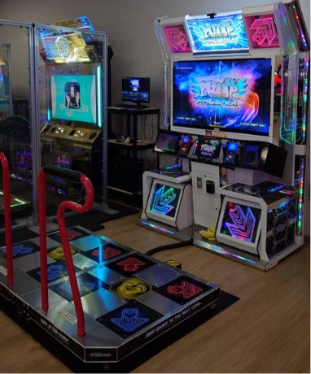
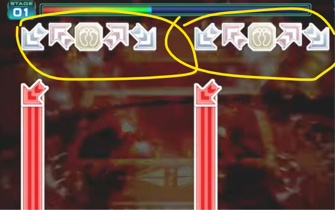
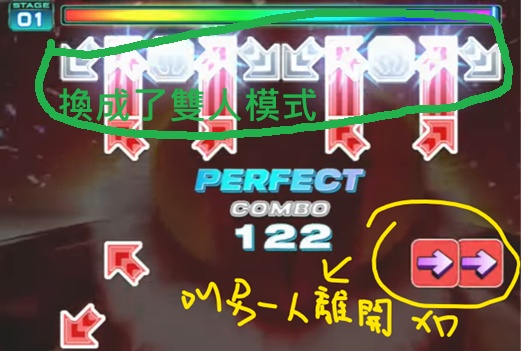
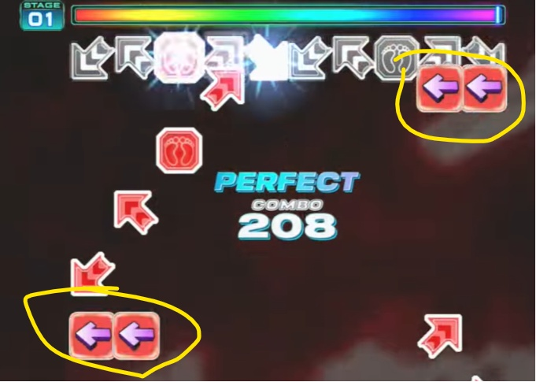
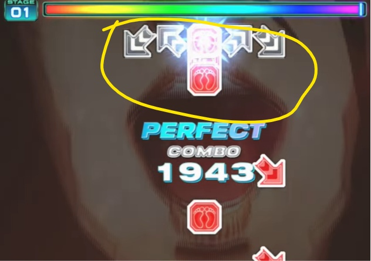
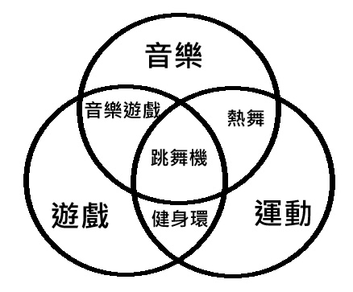

　　上周六在高雄駁二 WAREHOUSE 當靜態攝影，整個下午斷斷續續舉著接近三公斤的相機，晚上吃雞塊時要沾醬手都在抖（新人攝影的震撼教育），原本周日鐵定是待在家裡好好休息一步都不想踏出家門，突然得知有朋友來高雄，還問要不要一起玩《Pump It Up》跳舞機。

　　啊……都這麼難得了，只好再度前往高雄車站拍照「順便」[^1]玩一下。

　　說到跳舞機，大家想到的或許是有著上下左右四顆按鍵的《Dance Dance Revolution》（簡稱 DDR），而那首 smile.dk 的 [Butterfly](https://www.youtube.com/watch?v=bI_-IORv6Aw) 或許也是許多人的童年回憶。但當初在[《beatmania IIDX》DP 十段](/music/iidx-dp-10-dan/)）提到：

> 當時的我，應該是大學和朋友一起去大型電玩間，看到一台非常顯眼的跳舞機擺在門口，覺得有趣就上去玩了一下。之後漸漸養成了習慣，半夜有空就和一群朋友騎著半小時車程的機車，去電玩場玩打鼓機和跳舞機。
> 

　　沒錯，這裡的跳舞機不是指 DDR，而是上面照片內的韓國跳舞機《Pump it Up》（簡稱 PIU）。雖然遊玩方式和 DDR 大同小異，只是按鍵配置恰好比 DDR 多了一個鍵，所以兩邊總共 10 個鍵。在那些「真的像是在跳舞的跳舞機」出現之前[^2]，大型電玩間只有這兩台可稱為跳舞機的遊戲。當然，音樂遊戲搞到最後都會背離初衷，當歌曲難度越做越難，玩家也漸漸不是在「跳舞」，而是在挑戰極限運動，所以曾經還被戲稱為「鐵板螞蟻機」[^3]。

　　很久以前我就「放棄」PIU 這遊戲了。說放棄也不太精確，而是因為這機台太冷門，在 2026 年今天全台已所剩無幾。雖然遊戲本身還是有在更新（韓國遊樂場也很常見），但台灣沒有新玩家（就算有也都在玩 DDR），而以前的核心玩家多半都自己買一台在家裡玩（你沒聽錯）更省事。賠錢生意沒人做，從某年開始，濁水溪以南再也沒有任何一台 PIU，不是我不玩，是 PIU 不讓我玩，真是抱歉。

　　也因此，我很久很久沒有跳 PIU 了，由於 DDR 較為普遍，想玩跳舞機時多半都找 DDR 跳，大概就跟快打六是我的 KOF 代餐[^4]差不多。由於最近外務太多，上次跳 DDR 已是去年，PIU 則是三年內不知道有沒有玩過一次。　

　　但就在去年得知高雄某間電玩場居然引進了 PIU，還是最新版本。再加上朋友邀約，不管昨天拍照拍得多累，今天還是踏進了這好久沒來的大型電玩間。

　　沒過多久朋友也到了。雖然在網路上很常和這位朋友聊天，但一開始是因為其他原因認識，某天陰錯陽差才知道他也有在玩 PIU，而且我們從來沒有一起玩過。

　　任何遊戲玩家遇事不決都是直接靠遊戲交流搞定。此行相約的最大目的，就是 PIU 有個非常厲害的「合作模式」。放眼望去所有的音樂遊戲都是「單人遊戲」，就算是「雙人模式」也是一個玩家玩一邊，本質上只是兩個人一起分別玩，但 PIU 的合作模式卻是同一個譜面，上面分別用藍色和紅色的箭頭標示了兩人該跳的地方，貨真價實地在「合作」，就像下面這樣：



　　（Song: Discord by QWER Mode: Co-op Red side: KERO Blue side: LQ7）

　　因為有現場實錄，所以看得到兩人在機台上的移動方式，挺酷的不是嗎。

　　和其他合作類型遊戲一樣，除了各自的基本功外，也需要一定程度的信任感，不然踩到別人或交換位置時撞在一起也是常有的事。

　　短暫熱身後，我立刻和朋友提議，（趁還沒太累）該來挑戰《Tepris》這首歌看看，朋友聽到立刻露出「真的假的」的表情。

　　雖然早就不懂現在機台歌曲內生態，但猜測就算是現在，合作譜面能比「Tepris」難的也沒幾首了。老實說，我也不敢確定事隔多年自己還玩得玩不起來，因為這首歌的單人雙邊譜面難度對標 20 等[^5]，現在貴為幾年沒玩的休閒玩家，鐵定玩不了。

　　但 Tepris 的合作譜面，有兩人分別 Solo 的地段，比起單人譜面體力上負擔較小，嗯……

　　不管惹，玩了再說啦！



　　（Song: Tepris Mode: Co-op Red-side: KERO Blue-side: LQ7）

　　當尾奏熟悉的俄羅斯方塊 Riff 響起來，心中快速閃過好幾個念頭：

　　「天啊，實在有夠好玩」

　　「天啊，我真寶刀未老」

　　「天啊，朋友根本太罩」

　　又是《葬送的芙莉蓮》費倫那句老話——「拼命累積起來的東西，絕對不會背叛自己」。雖然解譜能力下降、施力方式沒有從前精細、體力也不是當打之年，但藏在腦內深處的肌肉記憶和平日維持的運動習慣終究沒有背叛自己，直到最後血條永遠是滿的，一起和朋友過了這首不簡單的曲子。

　　朋友事後在群組也說「好久沒有遇到能一起過俄羅斯方塊的人了」，我想也是。PIU 機台難找，玩家更難找。這也是為何就算這麼多年沒玩，依然不願意輕易放棄這個能和朋友玩 PIU 合作模式的機會。這次不來，不知道要過多久才能找到另一個能一起過《Tepris》的玩家呢。

　　隨後我們也一起嘗試了更加新潮的合作譜面。這首 Doppelgänger 第一次跳完後覺得奇怪，明明是合作譜面，為何只有一種「紅色箭頭」，顯示方式也一直換：

　　曲子一開始，居然是兩個單人譜面的顯示方式。但前奏結束後，立刻變成了「單人雙邊」譜面：

　　此時譜面居然提示另一人離開機台，因此變成單人遊玩雙邊的譜，過一陣子後，台上的人從左邊離開，換另一人回來。

　　最後中間短暫地切回雙人單邊模式後，變成了熟悉的雙人 co-op 模式譜面，兩個人都在台上，但最沒想到的，明明是雙人模式，但卻跳一樣的譜面，最後雙邊顯示直接變成了單邊顯示！

　　第一次遇到這段譜面的時候，我還在台上發呆，想說現在是怎樣，朋友立刻表示 1p 2p 同時都要跳，只有一邊跳會不算數，真是太神奇了。

　　最後譜面回到了雙人單邊模式，卻只有一邊有 note，另外一個人的譜面就像是結束了一樣。

　　當我還在疑惑整首歌譜面設計到底想幹嘛時，朋友查了這首歌的歌名後大感驚訝：

> Doppelgänger（德語），意思為「分身」、「二重身」、「長相極為相似的人」。（[維基百科](https://zh.wikipedia.org/zh-tw/%E5%88%86%E8%BA%AB)）
> 

　　也就是說，Doppelgänger 就是「在現實世界的另一個自己」。

　　天啊！雞皮疙瘩都起來了！這首歌的合作譜面並不是隨便寫寫，而是為了這首歌歌名量身訂製的譜面！當下我們立刻再玩了一次：



　　（Song: Doppelgänger Mode: Co-op Red-side: KERO & LQ7）

　　為什麼只有紅色的箭頭而不像一般譜面分成紅色藍色，也完全說得通了，因為另一個人從頭到尾就只是「Doppelgänger」而已，真是太有趣了。

　　最後我們陸陸續續玩了快三個小時，直到朋友餓了，加上我小腿也快抽筋才善罷甘休。相比其他音樂遊戲 PIU 省錢許多，因為就算預算沒有上限，體力也有上限，只要其中有幾首高難譜面，喘氣的時間或許比遊玩的時間還久。

　　回程車上，我不禁想起先前同樂會主題「[理想的日常](https://alexhsu.com/perfect-days-2)」，如果要重寫一次，我大概會寫早起整理行李，中午去高雄車站拍拍照，下午和朋友跳跳 PIU，晚餐跑去吃楊寶寶煎餃。

　　當下的感受是，實在沒有比這更理想的日常了吧。

### 後記

　　我曾經想過「音樂」、「運動」與「遊戲」[^6]，這三者都是我非常喜歡的娛樂項目。如果同時喜歡音樂與運動，那麼或許適合打鼓或跳舞。如果同時喜歡音樂與遊戲，那麼就是坊間所有的「音樂遊戲」都值得遊玩，如果同時喜歡運動與遊戲，那麼 Switch 健身環或許是個選項。

　　但真要說能結合這三者的，似乎只有跳舞機了。它是音樂，也是運動，也是遊戲。這或許就是最適合我的娛樂也說不定。

　　相比於之前不建議現在入坑的 IIDX，跳舞機無論是 PIU 還是 DDR，只要敢踏上去玩，就算是新手或路人，我相信依舊能感受到遊戲的樂趣。下次如果有看到類似的機台，推薦大家可以試試看。

　　有關跳舞機的回憶實在一言難盡，真要寫可能不是一兩篇 Blog 文章就能說得清楚，但畢竟沒打算出成什麼回憶錄之類的，在此不多贅述。然而，原本只是想記錄一下星期日的回憶。但忽然想起六月同樂會主持人柚子似乎[常居韓國](https://www.yozblog.com/about/)，或許有機會遇到這台跳舞機也說不定。

　　所以，這是我第二篇[^7]「[BlogBlog 同樂會 - 2026 年 6 月](https://www.yozblog.com/posts/music-and-memories/)」的投稿文章，也是我首次同樂會主題一次投稿兩篇的文章，希望大家會喜歡 🫠

[^1]: 雖然現在都下意識把拍照當正事，但或許這次拍照才是順便。

[^2]: 比如說 [Dance Evolution](https://www.youtube.com/watch?v=MdTjLrc3Qt0)（已停止營運），或現在當紅（？）的 [DANCERUSH STARDOM](https://youtu.be/-QQ2u1Z4axU?si=68frGSK-az2jwD3v&t=659)。（點進去有遊玩影片）

[^3]: 大概從熱鍋上的螞蟻得名，腳非常忙。

[^4]: 關於快打旋風我也有[寫篇文章](/mood/sf6-menard-vs-daigo-ft10/)，可以來看看。但如果以主修來說，我是 KOF 玩家。

[^5]: 輝煌時期我的最高難度大概也是只能玩 20~21 等的歌，PIU 23 等以上的歌簡直是要人命，最高難度 28 等，基本上就是用腳在玩 IIDX，不信的話請看 [FEFEMZ 這位或許是全世界最厲害的大大示範](https://www.youtube.com/watch?v=zwOhCxks5IU)，順帶一提，畫面這麼多 note 是正常，PIU 極難譜面必須練習一隻腳踩兩個按鍵去解譜，簡直莫名其妙。

[^6]: 其實「運動」我認為也算廣義的「遊戲」，所以這邊泛指的是「電子遊戲」。

[^7]: 第一篇是開頭提過的[《beatmania IIDX》DP 十段](/music/iidx-dp-10-dan/)。