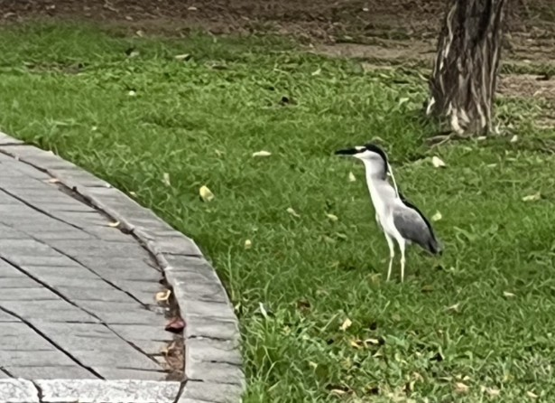
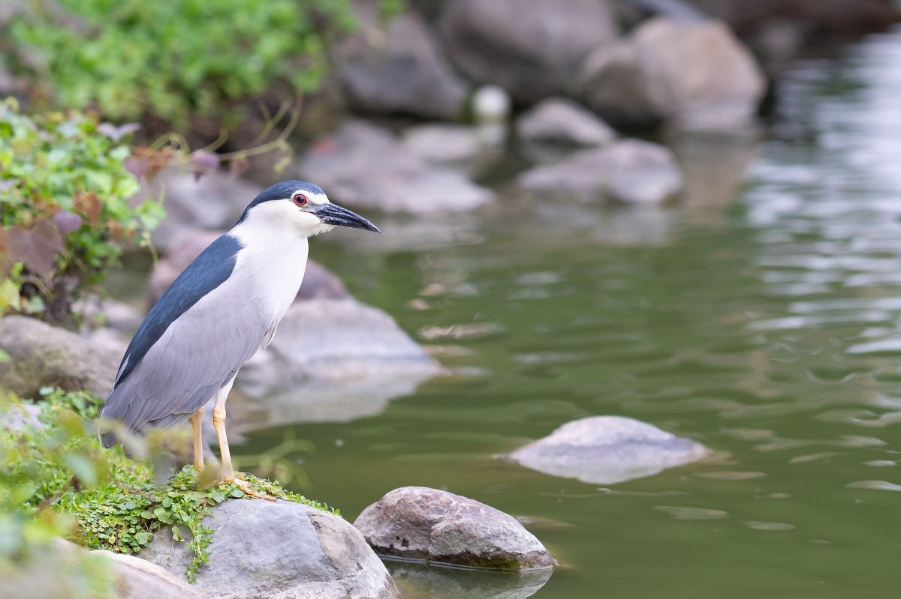
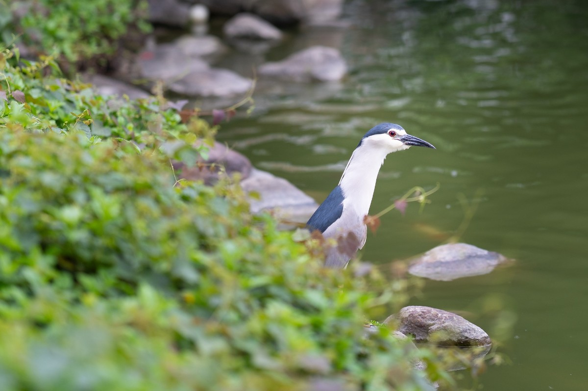
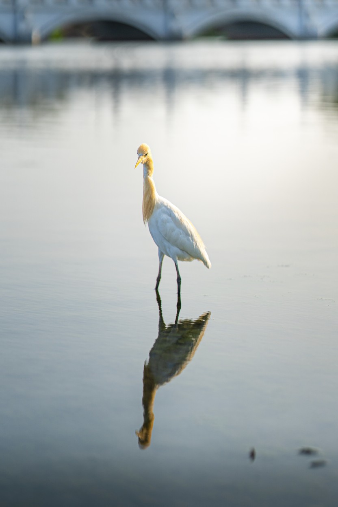

　　昨日去聽《航海王》動畫交響音樂會，在先前聽說場地附近有人看到夜鷺，雖然不確定能不能遇到，就提前過去走走。

　　結果剛停好車，走沒幾步就在路邊就遇到了一隻！

　　結果還沒來得及拿出相機，就被路過的阿伯嚇走了 QQ（這張是太太用手機拍的）

　　但好在前面就是個大池塘，往前走沒多久，就發現站在池邊的夜鷺，應該是同一隻 XD，雖然焦段不夠長，但經過躡手躡腳緩慢靠近後，終於讓我拍到啦！

　　（Sony A7m3 + 85mm F1.4 GM II，南崁企鵝[^1]真的可愛又好笑 XD）

### 後記

　　拍照現在對我來說，照片成品反而是個附帶的結果，畢竟如果只是想要個夜鷺的照片，網路上要多少就有多少，但自己拍出來的照片，我發現記錄著不只是照片的內容，更多的是踏在池邊石頭想辦法不要跌進池裡緩緩靠近，看著夜鷺脖子伸長又變短，期待下一秒它又會做出什麼動作，這張照片乘載著的回憶，比想像中來得多上許多，這也是現階段我對攝影的想法——我覺得我在認真享受著它的過程。

　　經過這幾次（包括先前跑去奇美博物館拍的黃頭鷺），我覺得鳥類攝影真的很好玩（可能我本來就很喜歡鳥），有考慮是不是要買個超長焦認真玩一下。

　　（奇美博物館的黃頭鷺。又是個 85mm 極限拍攝，但很有趣！）

[^1]: 臉書社團「TPC台灣鸚鵡聯盟」分享一則貼文，一名疑似警員的網友在臉書指出，獲報在南崁溪邊發現企鵝，結果到場一看，是台灣各地隨處可見，喜歡生活在水邊的夜鷺。（2018年新聞）（自此之後此暱稱廣為流傳，甚至很多朋友只知道南崁企鵝反而不知道原名）