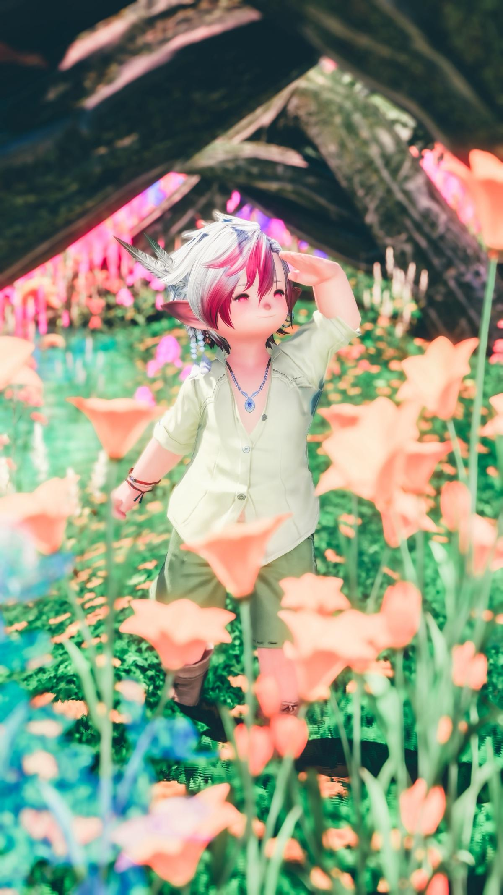
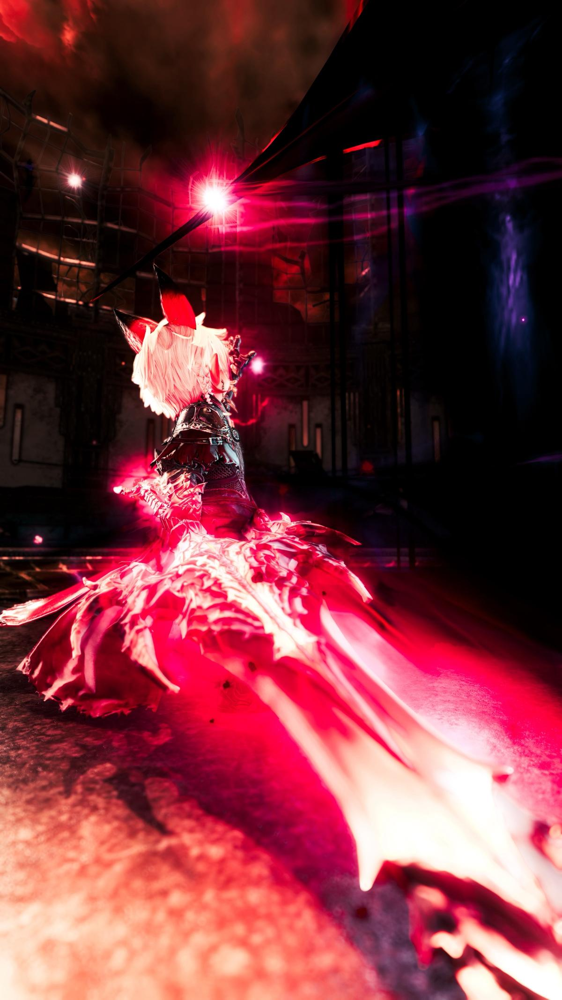
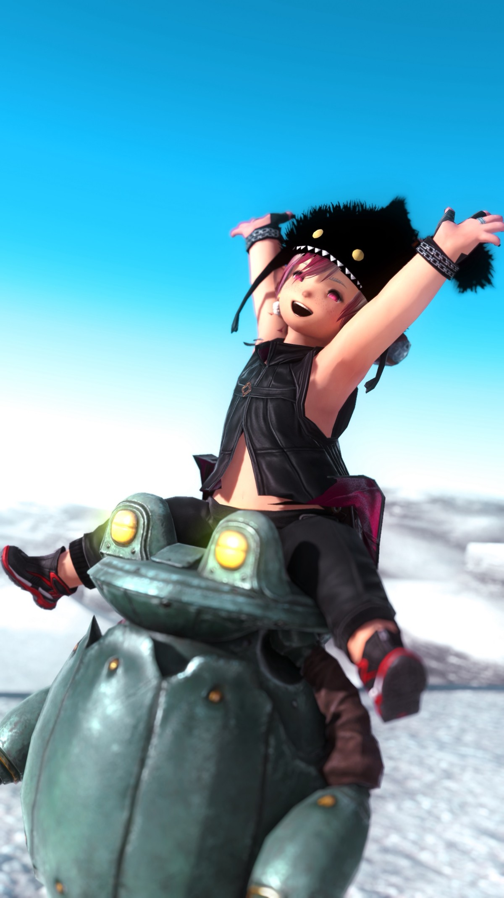
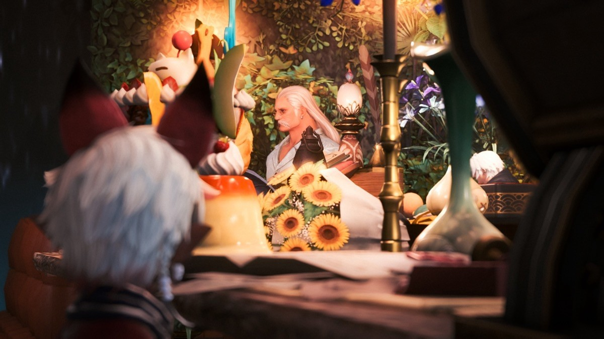
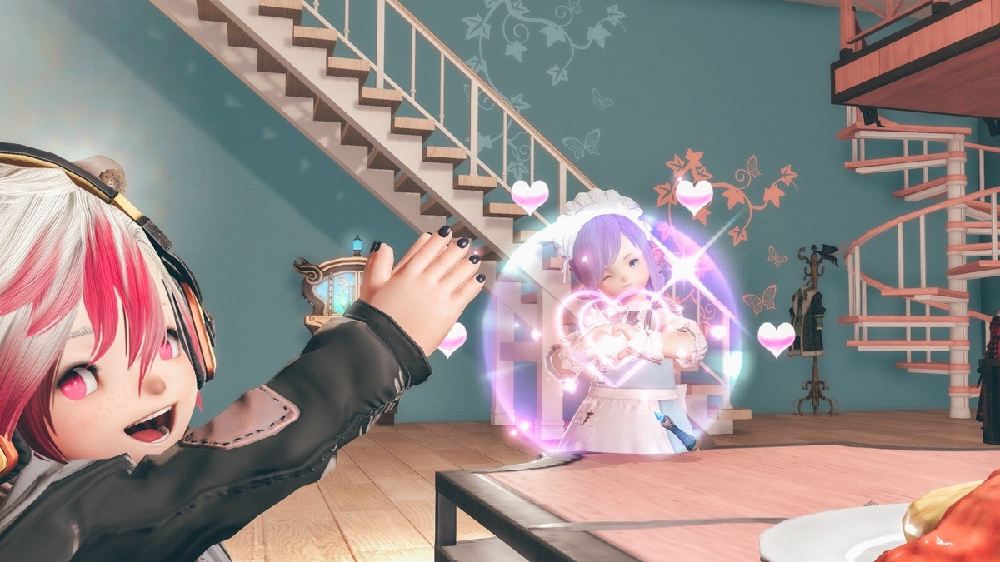
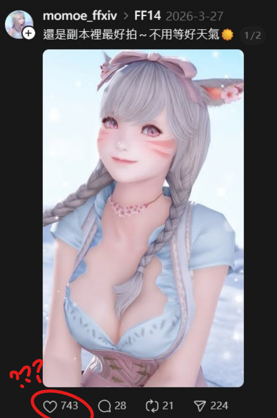

　　最近不少朋友沉迷[《FINAL FANTASY XIV》](https://www.ffxiv.com.tw/pr/)，有位平時在跑表演攝影的朋友，說他在 FF14 裡面也在當「攝影師」，並分享了幾張照片。

　

　

　　朋友Ａ：「這幾天的光之攝影師」[^1]

　　我：「……真不錯」

　　朋友Ａ：「在 FF14 裡面都能跑女僕店，這世界真的變得很荒唐」

　　我：「？？？」

　　朋友Ａ：「這間是玩家開的咖啡店」（下圖）

　

　　朋友Ａ：「這間是玩家開的男娘女僕店」（下圖）

　

　　我：「……」

　　和不了解 FF14 的讀者們說明一下——遊戲內並沒有什麼「攝影師」的職業，每個人都有相機模式可以螢幕截圖而已，也沒有「開店」的機制，最多就是可以自己買塊空地蓋房子擺家具，也就是說，這群人在「角色扮演遊戲」內搞了另外的「角色扮演」。

　　原本以為這件事情就過去了，沒想到今天又和朋友聊到脆上有人表示 FF14 的男性攝影和女性攝影拍出來的照片構圖喜好不同，大意是這樣的：

> 跟朋友聊到FF14裡男玩家和女玩家拍照的取向不太一樣，女生傾向拍關係性／故事性，男生傾向拍角色的身體特質，而且男生的那種拍法比較容易拿到讚……🤔
> 

　　朋友Ａ：「根本胡扯，一堆自己角色是兔男或男精也是超大特寫在那邊發廚，我才不信他們本體是男生 XDD」

　　這引起了我的好奇於是跑去脆上搜尋了一下。不搜還好，一搜直接跳出這個：

　

　　……。

　　「那種比較容易拿到讚」的拍法立刻出現啦！拍得真好，呃不是，真要不得！

　　我：「我看 FF14 根本就是現實世界，別吵了 XDDDDDD」

　　朋友Ａ：「百分之百男 (x」（指拍攝者性別）

　　藉此機會，我們又繼續聊了 FF14 攝影相關話題：

　　我：「我現在滿腦子想的是 FF14 內總覺得要能拍 RAW 檔」[^2]

　　朋友Ａ：「真的超想要＝＝」

　　我：「感覺 FF14 裡面也要可以賣相機，官方還能多薛一筆」

　　朋友Ａ：「……那應該會炎上」

　　我：「而且還要分 APS-C 和全幅」

　　我：「高級相機才有翻轉螢幕，沒有的角色只能蹲下去拍 XD」

　　朋友Ａ：「天才」

　　朋友Ａ：「以後想要拍大場景，請到商城加購空拍無人機」

　　我：「無人機沒控好掉河只能再買一台」

　　因為越聊越起勁，所以跑去搜尋了更多 FF14 攝影相關的照片和影片，還發現了[這個 Threads 影片](https://www.threads.com/@chiheka/post/DUlnFHNE6tW?xmt=AQF0j87evq7fNLIL50mbfYd7kunKTtEEmiLv4vtRdzXVdg)：

　　我：「……這個太強了吧[^3]，連 IG 廢片都能拍我真的要笑死」

　　朋友Ａ：「這群人就是完全用遊戲在做一樣的事情，昨天還看到這影片」



　

　　拍電影到底什麼意思？真的是發瘋了（稱讚意味）🫠

### 後記

　　[《FINAL FANTASY XIV》](https://www.ffxiv.com.tw/pr/)應該算目前最紅的日系 MMORPG 了。繁中服在 2025 年底終於有代理願意營運後，許多日服的老玩家紛紛回來支持。 2.0 日服剛開時自己也當了一陣子的光之戰士，後來因為 2.1 太農才退坑。但我覺得現在還在玩 FF14 的玩家有把 MMORPG 的精隨給玩出來（不少朋友還變成了現實朋友一起出遊），FF14 Only 同人場在台灣也是人滿為患，創作能量爆棚，真是發自內心讚賞。

　　雖然現在自己鐵定沒時間玩 MMORPG，但今年三月底台服開放玩家在 70 級前都是免費試玩（應該是夠玩一兩個月），有興趣（夠閒）的朋友可以試試，或許可以在上面找到屬於自己的樂趣。[^4]

[^1]: FF14 玩家們因遊戲劇情所以被稱為「光之戰士」。

[^2]: RAW 檔是未經處理、保留最完整感光資訊的原始影像格式，提供極大的後製修圖空間且不會如 JPG 產生壓縮失真（ AI 摘要）

[^3]: 強點在 FF14 裡面的角色並不能隨心所欲做出任何動作，所有的 Pose 都是官方的「表情動作」預設集來，因此要能編排出這角色一系列的動作，也得煞費苦心。

[^4]: 相關閱讀：[關於FF14在戰鬥和劇情以外的吸引力](https://forum.gamer.com.tw/C.php?bsn=17608&snA=24526)（巴哈論壇連結）