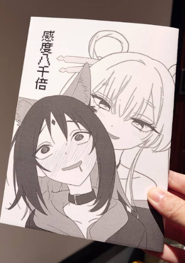

### 序

　　這是一部藉由日本民間故事《竹取物語》發展，周圍朋友一致好評的動畫電影。雖然我向來不立刻跟風話題性作品，但就在 FF46 場次上拿到了 CEMA 老師出的突發同人本，他提醒我最後有故事的大捏他，沒看原作就無法看這本書（強迫推銷？！），為了看看 CEMA 老師到底畫了個啥（？），於是只好在前天將動畫看完了。

　　由於心得本文有雷，所以這邊先說結論——我認為這是一部製作精良、值得一看的動畫，如果了解V系文化或常看其他動畫的朋友，更能從其中編劇的小巧思獲得額外樂趣。以下心得會**提及動畫劇情（有雷！劇透注意！）**，建議先看完原作再繼續看下去。

（CEMA 老師的同人本，超快！雖然封面有點……但其實是一般向 XD）　　

### 本文

　　如果是十幾年前的我，大概不會喜歡這部動畫。

　　即使到了今天，我對故事劇本依舊異常執著。先前在[《我的 AI 使用手則》](/thinking/my-ai-principles/)提過「找出最好的棋譜」是下棋的棋道，然而對於文字、圖片或影視作品，或許我下意識也想找到心目中「最好的故事」[^1]——在看完後，能與作者編劇共感「一字一句都不想更改」、「角色刻畫真是立體」、「每個隱喻都好棒」或「這真是個完美的故事」等滿足情緒。

　　也因此，《超時空輝耀姬！》兩位主角的個性與互動方式已在其他地方體驗過[^2]，劇本沒有超越框架的創新，敘事節奏分配不均，故事邏輯略嫌草率，那些耳熟能詳的重編與原創歌曲，曲風也不是我喜愛的類型。這部各方面都沒有達到內心期待的作品，當然不會像《虛構推理》那樣，看完立刻就覺得「哇，真是超乎想像的動畫」[^3]。

　　但，現在的我，認為這依舊是一部不錯的動畫電影。

　　就算以上的道理我都懂，但觀影的當下還是能和彩葉一起與輝耀相遇、一起成長、一起解決內心與家庭問題，並感受輝耀的歡笑與離別的情感。就算劇情沒有超乎想像，八千代與彩葉相認時我依舊發自內心為她們感到開心。導演用了詼諧的方式帶過許多原本該是沉重的橋段[^4]，故事當中也有許多致敬其他動畫的台詞與畫面，雖然這些一直都不該是描繪故事的重點，但觀看時就像透過彩葉的視角和輝耀相處那樣，有點無厘頭又有點煩，卻又處處藏著溫馨，像是身歷其境體驗著輝耀的能量與歡笑。

　　一場魔術表演，魔術師在不到三公尺的距離浮了起來。理性上你知道大概又是看不見的鋼絲或機關，但眼前的畫面卻久久不能忘懷，這就是《超時空輝耀姬！》給我的感受。它靠著作畫表現和臨場感，讓人忽略了種種「或許可以更好」的細節。或許和[《一百公尺》](https://www.youtube.com/watch?v=1ENmkryGOcw)一樣，這故事需要觀眾的一點耐心，需要一個大螢幕讓大家一起跳入「月讀」的世界中，但我認為這一切都是值得的。

　　整個故事中「月見八千代」與「月讀」，讓我想到[《The Man from Earth》](https://zh.wikipedia.org/zh-tw/%E8%BF%99%E4%B8%AA%E7%94%B7%E4%BA%BA%E6%9D%A5%E8%87%AA%E5%9C%B0%E7%90%83)這部電影。如果「竹取物語」的故事是輝耀自己創造，那麼或許她也同樣是「月讀」神祇本人也說不定呢。

　　最後，如果是同樣喜愛這部電影的年輕朋友，那麼我想推薦[細田守導演](https://zh.wikipedia.org/zh-tw/%E7%B4%B0%E7%94%B0%E5%AE%88)的《[跳躍吧！時空少女](https://zh.wikipedia.org/wiki/%E8%B7%B3%E8%BA%8D%E5%90%A7%EF%BC%81%E6%99%82%E7%A9%BA%E5%B0%91%E5%A5%B3)》與《[夏日大作戰](https://zh.wikipedia.org/wiki/%E5%A4%8F%E6%97%A5%E5%A4%A7%E4%BD%9C%E6%88%B0)》兩部動畫電影。年輕時的我對它們總有些不滿意之處，但多年後重看，卻意外能靜下心來聽故事說話。或許這些年來從徹底 T 人漸漸變成 F 人之後，也比較能拋開理性，感受故事想傳達的情感了。

### 後記

　　最後的最後，推薦 CEMA 老師的突發同人本，雖然短短幾頁卻富含有趣的劇情，可以想辦法購買（因為不知道其他場哪邊還能買，請關注CEMA老師的最新參場訊息 XD）

[^1]: 我心中的確有幾部非常接近的作品。例如電影[《險路勿近》（No Country For Old Men）](https://zh.wikipedia.org/zh-tw/%E9%9A%AA%E8%B7%AF%E5%8B%BF%E8%BF%91)、[《十二怒漢》（12 Angry Men）](https://zh.wikipedia.org/zh-tw/%E5%8D%81%E4%BA%8C%E6%80%92%E6%BC%A2_(%E9%9B%BB%E5%BD%B1))，小說[《解憂雜貨店》](https://zh.wikipedia.org/zh-tw/%E8%A7%A3%E6%86%82%E9%9B%9C%E8%B2%A8%E5%BA%97)、[《愚者的片尾》](https://www.books.com.tw/products/0010546676)，動畫[《吹響吧！上低音號》](https://zh.wikipedia.org/zh-tw/%E5%90%B9%E9%9F%BF%E5%90%A7%EF%BC%81%E4%B8%8A%E4%BD%8E%E9%9F%B3%E8%99%9F)等等。

[^2]: 自從輝耀在劇情中出現後我就和室友（？）說這根本是[奧澤美咲x弦卷心（mskk）](https://www.bilibili.com/read/cv11138395/?opus_fallback=1)，互動方式如出一轍外連髮色都差不多。結果看完後才發現不只我這樣覺得？！

[^3]: [《虛構推理》第一季動畫無雷心得](/reading/in-spectre/)（以前寫過的心得文）

[^4]: 一般利用家庭問題推動劇情的作品多半會實際演出製造觀眾內心的沉重。如[《四月是你的謊言》](https://zh.wikipedia.org/zh-tw/%E5%9B%9B%E6%9C%88%E6%98%AF%E4%BD%A0%E7%9A%84%E8%AC%8A%E8%A8%80)中男主角與媽媽的回憶互動，[《BanG Dream! Ave Mujica》](https://zh.wikipedia.org/zh-tw/BanG_Dream!_Ave_Mujica)祥子家庭關係都是。