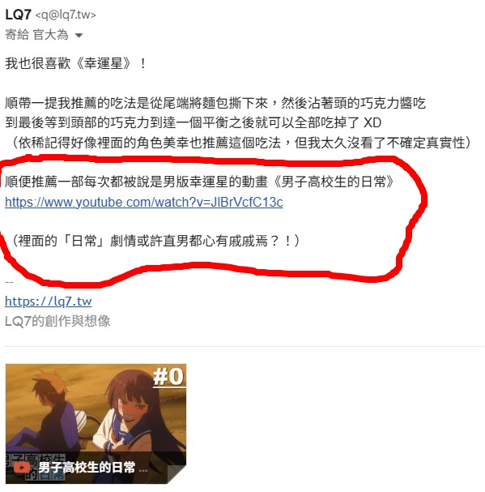

　　（前情提要：[構成我的九部動畫](/mood/nine-anime-that-made-me/)、[續](/mood/nine-anime-that-made-me-2/)）

　　看到 Shuyu[《2026.04 回顧》](https://shuyulin1127.com/2026-04-review/)提到「唯獨《男子高校生的日常》反覆看了好幾次」時，眼睛突然亮了起來。

　　因為我也超喜歡！當時 Wiwi 寫了篇[《注意到的感動》](https://wiwi.blog/blog/noticing-things/)表示他很喜歡《幸運星》後，我立刻寫了封信，向 Wiwi 推薦了《男子高校生的日常》：

　　當時 Wiwi 很快就回覆了：

> 「男版幸運星怎麼聽起來讓人興趣缺缺（對於一個直男來說）XD」
> 

　　……的確非常有道理，畢竟直男就是喜歡看香香妹子在螢幕裡面愉快地聊天，或者進行露營[^1]之類的活動。不過仔細回想，《男子高校生日常》裡面我最喜歡的兩個角色也都是女角！（沒錯，這部動畫並不是只有臭男生而已 XD）

　　第一位是小蘋果（りんごちゃん），女校的學生會會長，動畫中後期會出現，有關她的劇情都超好笑。

　　第二位則是「文學少女」，喜歡坐在河岸邊看書，和主角群有些邂逅。第一集就出現了，超好笑之外 ED 也是超乎想像，在此不暴雷，強力推薦自行觀賞。

　　如果《幸運星》是「一群高中女生聚在一起愉快地聊天」，那麼《男子高校生的日常》反而是「一群高中男生聚在一起耍白爛」。周遭喜歡這部動畫的朋友壓倒性地都是男性（保守估計超過九成），女性多半反而興趣缺缺（這樣說來拿「男版幸運星」來形容的確不太精確，因為如果這樣形容受眾應該是偏女性才對）。也因此在得知 Shuyu 喜歡這部動畫時，實在非常令人意外 XD。

　　先前考慮「構成我的九部動畫」文章時，這部或許就是那「第１０部」動畫。可惜「喜歡的動畫」和「構成我的動畫」意義上終究有些不同，最後還是沒將《男子高校生的日常》排上去。

　　不過就算這樣，我還是誠摯推薦《男子高校生的日常》，目前[木棉花的 YT](https://www.youtube.com/watch?v=JlBrVcfC13c&list=PL12UaAf_xzfqraJF07Kgtx6iYNmFUyeBS) 依舊有得看，有興趣的朋友可以嘗試一集，大概就能知道合不合胃口了。這也是每隔一段時間我會重新拿出來溫習的動畫，看來又到了該溫習的時候了 XD

[^1]: [搖曳露營](https://www.youtube.com/playlist?list=PLC18xlbCdwtScQVd3nudOfH4Zh4aT8inV)，也是非常不錯的一部日常系動畫！