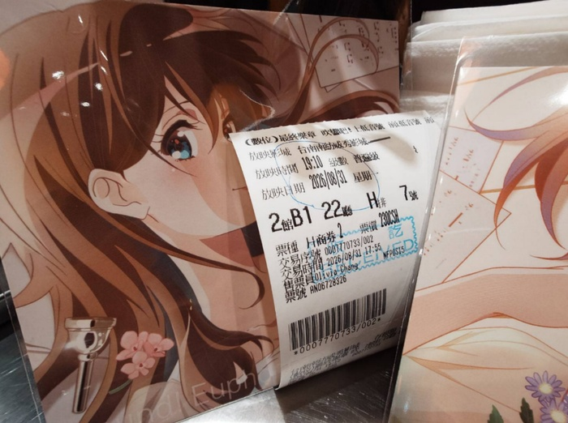
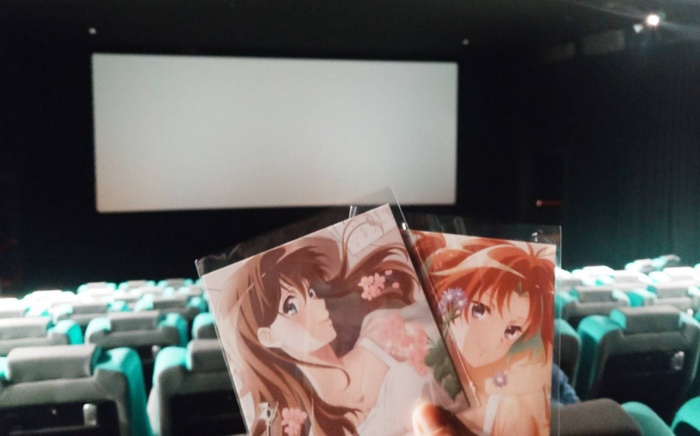
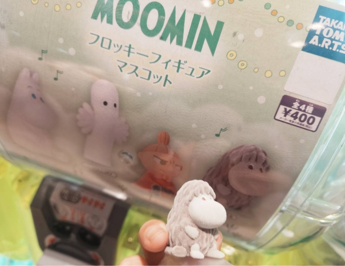

　　這輩子目前最喜歡的動畫最近冷飯熱炒，將第三季（最終章）的動畫製作成劇場版，上星期五終於在台灣上映了。[^0.5]

　　就算沒那麼喜歡進電影院看電影的我[^1]，此時也不得不嚴肅思考一個問題，那就是如果這部電影連我都不進電影院看，到底有誰會進？唉，天將降大任於是人也，立刻在網路刷了雙人特典套票組[^2]，順便找了個~~替死鬼~~朋友一起消耗剩下多出來的那張票。

（買色紙送電影票（？），但海報特典得去另一個影城拿，神人規劃🫴）

　　一進電影院，哎呀，果然高朋滿座：

　　撇開天將降大任於是人也的部分，這和在家看基本也沒兩樣，真是來對了（？）

　　《上低音號》第三季的動畫大改了原作的關鍵劇情，讓很多原作粉非常不滿，但我一直認為，這是看過這麼多改編作品以來我最喜歡的原作改編，也完全能感同身受為何導演不惜更改關鍵劇情，也要讓劇情這樣發展的心情。至於心得，我想等到劇場版後篇上映後再說。

　　如果沒看過《上低音號》的朋友，誠摯推薦這部講述高中青春的管樂團動畫，有別於現在動畫主流的極端與直白，作品裡面每個角色個性非常立體且震撼人心，就算我在[〈九部動畫〉](/mood/nine-anime-that-made-me/)中已推薦過，但不影響我再推薦一次，如果這輩子只能選一部動畫反覆觀看，那麼我會毫不猶豫選擇《吹響吧！上低音號》，在我心中，他就是京都動畫到目前為止最偉大的一部作品。

　　好想趕快看後篇Ｒ，日本 9/11 就上了但台灣不知道何時會上，看來只能請在日本的[李唯大大](https://wei-lee.me/)先去幫我看了。

### 後記

　　離開電影院後轉了個魯咪[^3]的轉蛋（上次轉蛋應該是好幾年前了），一發抽到想要的隻——「祖先魯咪」：

　　祖先嚕咪的周邊本來就出得不多，能抽到超幸運也超可愛！

[^0.5]: 日本四月底上映，台灣晚了一點。

[^1]: 藏在眾多打羽球文章中超難找到底在哪，最後索性連到 yangbear 的[帥熊看電影](https://yangbear.bearblog.dev/kumaeiga/)後終於找到[原文出處](/mood/thursday-badminton-10/#fnref:3)，感謝大大的跨域連結（？）。

[^2]: 不刷單人特典套票組是因為單人和雙人的套票組特典送的海報樣式不一樣，我比較想要雙人送的樣式，結果就是多了一張電影票出來。

[^3]: 雖然現在中文正式翻譯名稱是「姆明」，但我還是比較喜歡叫「魯咪」。