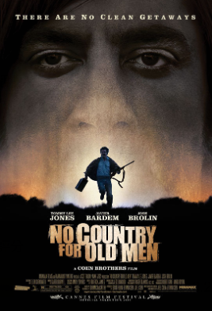

### 前言

　　以前有上 [imdb.com](http://imdb.com) 記錄電影評分的習慣（但到某年後就漸漸懶了）。雖然看過的電影可能有幾百部，但標記為 10 分的電影只有六部，藉由最近格友的電影話題重溫了自己以前的評分後，決定分享一下那些打了 10 分的電影們。

### **《險路勿近》（No Country for Old Men）**

　　到目前為止最喜歡的一部電影，之所以打 10 分，是因為 imdb 沒有 11 分的選項。依照 Alex 的 [Meta考績](https://alexhsu.com/five) 說法，其他 10 分的電影如果是「Greatly Exceeds Expectations（大大的超越了預期）」，那麼這部電影就是「Redefines Expectations（重新定義預期）」。

　　這部電影好看在哪？大概在它的「表」和「裡」完全符合我對電影這門藝術的最高期待。任何角色的動作、想法與對話都在默默表達故事核心思想，直到最後警長講完話整部劇突然結束，驚愕之餘腦袋不停地思考，直到最後回想到片名時，全身突然起了雞皮疙瘩。

　　片中也有到目前為止我認為演得最好的反派。Javier Bardem 飾演片中的殺手和角色融為一體，直逼心中那演技不可言喻的中心，就算上次重溫這部電影是好幾年前，依然能回想起這反派的神韻和講話的方式。第二好的反派我想大概是，嗯……薩諾斯？[^1]

　　我不認為所有人都該來看這部片，因為就算是「故事的表面」也不是所有人都會有興趣的題材（懸疑動作片），而故事內側的「隱喻」也不是人人都能懂（爬了些大眾心得後的感想），事後得知這部電影當時獲得了四項奧斯卡，包括最佳影片、最佳改編劇本、最佳男配角和最佳導演時，也有種不意外之感（或許也是第一次如此認可奧斯卡的評審 XD）。

　　題外話，這也是我看過目前為止片名翻譯得最爛的一部電影，就算是「刺激 1995」片商好歹也是依據劇情類比而命名[^2]，雖然理性能懂如果「No Country for Old Men」翻成「老無所歸」會有讓人一眼看不出是動作懸疑片的問題，但翻成「險路勿近」卻更像是沒看懂電影最後擅自下了結論——「看吧，本片壞人最後都受到了懲罰，歹路不可行」之感，WTF？

　　總之，我依舊在等待能在心中超越這部電影的作品，可惜還沒等到。如果看過我的所有 10 分喜好後覺得有挑戰者，歡迎分享片名，我會找時間試試。

　　

### 《教父１》（The Godfather）

　　如果有人打算從 IMDB TOP 200 開始找老片看，理當會立刻發現在 IMDB TOP 5 長年佔據兩個位置的電影（現時點教父１在第二名，教父２在第四名）。但我喜歡教父１遠勝於２，甚至某段時期一直把教父１的完整劇情當成「前半部分是１，後半部分是２」（證明根本忘了２在演啥）。

　　雖然如今才知道這部是連《芭比》都拿來當梗的直男神片[^3]，但除了黑幫的打打殺殺，敘事流暢度搭配細體的畫面調色，不用過多的「說明」，單靠角色的對話和行動就能引人入勝，是我最欣賞的敘事手法。

　　不過就像《險路勿近》一樣，我不認為所有人都該來看這部片。現在想想我那群９分（目前有二十幾部）的 imdb 或許比較大眾一點？

　　

### 《１２怒漢》（12 Angry Men）

　　這部片雖然長年掛在 IMDB TOP 10，但就算 TOP 200 看了大半後，也沒有去動它，原因也很簡單——這部片實在太老了。1957 年，連我父母出生沒多久的黑白電影，是能有多好看？

　　天啊！超級好看！

　　故事乍看只是１２個中年男子在一個房間打打嘴砲，但除了是我最喜歡的推理向作品外，很難相信這劇本的巧妙程度，以及演員詮釋的精采程度是 1957 年的電影。或許藝術終究會隨著時代而漸漸改變，但也有就算以現在眼光來看依舊扣人心弦的作品，我甚至會想，1957 年都有人示範了，為什麼這市面上的爛劇本依舊滿坑滿谷？

　　聽說這部片是電影系之類的本科生必修，我想也是。本作劇本流暢度堪稱教科書等級，不知道劇本該怎麼寫該怎麼演才能精彩的，看這部電影就對了。10分當中的作品如果《險路勿近》是 11 分，那這部片可以說是我的第二名，或許可以給個 10.5 分？

　　最後《１２怒漢》我認為比起上面兩部都好推一點，如果不排斥推理劇情向電影，那我想這部片不會讓你失望。

### 後記

　　原本想要一次打完，結果才打完《險路勿近》就發現怎麼廢話這麼多，最後決定分成上下篇。各位下篇再見（？）

[^1]: 仔細想想薩諾斯（復仇者聯盟）應該是「我喜歡的反派」，和「演得好」意義上有微妙的差異。順帶一題如果提到演得好的反派，我猜十人有九人會說希斯萊傑的小丑。小丑的確經典，但私心還是更喜歡[不婚男的阿部寬](https://yangbear.bearblog.dev/3831/)或本片反派這樣的怪角。

[^2]: [一分鐘電影史：你知道《刺激 1995》為什麼要叫《刺激 1995》嗎？](https://flipermag.com/2016/02/16/1995/)

[^3]: 其實我沒看過《芭比》，我也是~~看報紙~~[聽別人說](https://www.vogue.com.tw/barbie-movies-tributes)才知道。