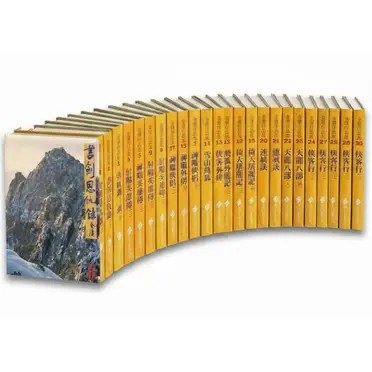

　　（本篇有金庸作品劇透，不介意者再請繼續閱讀）

　　看了碩人的[金庸作品短評](https://shuojen.com/blog/2026/06/21/jin_yung)後，原本想直接在底下留言，但想想金庸嘛，總是值得在自己版面留下點足跡，於是臨時有了這篇文章。

　　然而，畢竟七月是冷知識月（根本還沒到），於是我只好先來個關於金庸的 LQ7 冷知識作為開場——

　　每部金庸小說我都看過，除了「鹿鼎記」以外。

　　沒輟！直到現在，我還是沒有看過鹿鼎記，我也不知道為什麼，可能是因為得知主角不會武功或者聽說太色情（？）所以興趣缺缺？我也不知道，長大以後說要看，但就跟「以後再細說」一樣變得只是說說，實在是太好笑了。

　　順帶一提，我也是黃皮版本派，而且我記得這版本其實非常稀有，因為其他地方流傳的版本要嘛就是初版，要嘛就是比較新的版本，遠流黃皮版我還是最習慣一點，倒也不是覺得寫得最好，應該是最初的回憶還是最美導致？

　　（直接盜碩人的圖）（Ｘ）

## Tier 0

### 神鵰俠侶

　　和碩人喜好不同，我的喜好就是如此大眾 XD（？）。雖然我不太看改編連續劇，但沒記錯這部也是金庸被改編最多次的作品，甚至還[出過動畫](https://www.youtube.com/playlist?list=PLKgQAFMpjtUYm7pL6kf2orTPzD2wj9h9D)。

　　我認為金庸在這部就是想要寫出「武俠中這輩子最動人的愛情樣貌」，如果兩情相悅到無以復加，在這些情況之下，兩人會做出怎樣的決定呢？因此，在不同階段的不同遭遇，就是金庸的答案，兩人都在用「自己覺得」最好的方式為對方著想，也造就了如此曲折的劇情。而那些波折與看似狗血的橋段都還是有邏輯在，射鵰的因，帶到神雕之後的果，也是這部作品的一大特色。

　　之前看到某個 meme 是這樣寫的：

　　「16年之後，郭襄 18 歲，小龍女估計 40 歲，楊過腦袋燒壞？」

　　嗯，就是這樣。知道楊過有多愛小龍女了吧。（咦）

　　這部作品裡也有我最喜歡的武打橋段，就是楊過和小龍女初次雙劍合璧擊退金輪法王的劇情。此段將男女情愛混進武打的描寫真的太好，三不五時都會重翻這段出來看。而重陽山兩人重逢的橋段也超棒，那個「此人正是楊過！」的排版鋪陳，我總想找地方模仿，但一直沒有機會。

　　說到底，我應該就是喜歡如此曠世又絕美又能修成正果的愛情大戲吧。

　　不說了，等等又會~~上班找時間~~重翻「姑姑，浪跡天涯！」[^1]的地方了。

### 笑傲江湖

　　說到「修成正果的愛情大戲」怎能不提《笑傲江湖》呢？雖然沒有那麼曠世又絕美，但其中的表現卻更貼近「現實生活」，我想是它的重點。當然我不是說「關於我漸漸喜歡上邪教教主的女兒」這種輕小說書名如此貼近現實，但有看的人大概能理解。就算令狐沖這位男主角不像楊過那麼「狂」，女主盈盈也比小龍女更古靈精怪，但搭在一起卻非常有特色。相較神鵰俠侶一愛上就死心踏地的那種情愫，舊愛新歡的糾葛，反而是這部作品的看點。

　　真要說，笑傲江湖我「從頭到尾」翻閱的次數或許比神鵰俠侶還多。除了愛情戲方面，對人心險惡的探討也在武俠小說裡貴為一絕。整部戲裡面最遺憾的真是岳靈珊小師妹了。這世界上就是有明明心地如此正直善良，卻單單只是「運氣不好」（原本想寫陰錯陽差，但想想不是，一切都是命中註定），就搞到人生的最後還如此命苦的人，唉，講到這段劇情我心情就變得很差，唯一值得開心的是至少最後她和令狐沖有個最好的坦白收尾了。小師妹……嗚嗚嗚嗚。

　　裡面我最喜歡的部分除了令狐沖最後和許多掌門相遇的大決戰，最前面學會獨孤九劍後與恆山派一群人相遇的部分也很好看。不說了，怎麼要重翻的地方越來越多？

## Tier 1

### 射鵰英雄傳

　　這部說起來我覺得能給 Tier 0.5，畢竟我認為能把這樣資質駑鈍的主角寫得如此活靈活現，不是簡單的事。其中許多恩怨情仇，也好好地為了「神鵰俠侶」做鋪陳。說是鋪陳也不對，因為這種龐大的小說架構，多半不是一開始就想好，而是有點像「獵人」那樣走一步算一步，也就是說金庸的「自圓其說」功力和冨樫義博（HUNTERxHUNTER作者）不相上下，我認為加上神鵰俠侶連在一起看，正是金庸的顛峰之作。

　　當然，郭靖和黃蓉這對我也非常喜歡，觀察從射鵰年輕時期開始，直到神鵰為人父母後的心境轉變，也是非常有趣的看點。但整體而言，會擺在 Tier 1 大概是整齣戲沒有那種會讓我回去一翻再翻精彩時刻，或許郭靖一招「亢龍有悔」把對方搞得無可奈何，應該是我最喜歡的橋段了？

### 倚天屠龍記

　　看到上面大概也知道我的評斷標準了，這部會在 Tier 1 最大原因就是「無忌啊你到最後都還沒搞定這三個女人到底在幹嘛」，除此之外，我認為也是部精采的作品。當然魔教與正教糾葛的方式，我認為和笑傲江湖多有重複，因此，不如就直接看笑傲江湖（不是）。

　　說是射鵰三部曲，這部和上面兩部關係比較像是「後話」，在我心中更像是「射鵰二部曲」加上「倚天屠龍外傳」的感受。

## Tier 2

### 天龍八部

　　這部就更好理解了：三位主角，一位死纏爛打終成眷屬，另一位在一個冰窖待整晚就把到妹，最後一位超絕悲劇，天啊，怎看都不是我愛的劇情。

　　好吧，認真說大概是民族情結沒那麼打動我，或許是不夠曲折離奇，或許是三位主角的糾葛與故事線沒有很好地融在一起，很難把他當作「完整的一個故事」看。應該是我最少重翻的金庸長篇。

### 雪山飛狐

　　~~你是否在雪山救過一隻飛狐？~~

　　好巧不巧，去年因為某書友的一段話「雪山飛狐有致敬某些古典推理小說」而跑去重翻了一次。

　　現在看來，不要把它當成一般的武俠小說看，的確別有一番韻味。但，我不怎麼喜歡開放式結局[^2]，我也不怎麼喜歡胡斐，所以不管怎樣這部就只能在 Tier 2 ，真可惜（？）

### 其他

　　「什麼！剩下的都是其他？」

　　沒辦法，那些「其他」我好久好久沒有重翻了，因此根本記不得詳細劇情。比如說我根本忘記陳家洛跟那個誰來著的愛恨情仇，也只記得狄雲超慘但到底哪裡慘都忘光光，如果不是能從頭到尾記得劇情的部分，我是不會貿然排進 Tier。總之，在這之後的目標我想就是先把最後一部長篇「鹿鼎記」看完再說吧（啥）。

### 總結

　　如果完全沒看過金庸的朋友，我推薦就是先看「神雕二部曲」（射鵰英雄傳→神鵰俠侶），然後再看《笑傲江湖》，然後看要不要看《倚天屠龍記》，再來「其他」，差不多是這樣。

　　以上です！

[^1]: 在第十四回〈禮教大防〉中間附近，楊過小龍女在酒館和金輪法王的打鬥。

[^2]: 嚴格說來不是，因為我喜歡《Inception》，也喜歡《１００公尺》，真要說來我不喜歡的是「沒有意義」的開放式結局，也就是說，「這個地方如果用開放式結局會更好」就完全沒問題，反之「啊好懶得想結局讓讀者自己想像好了」，當我發現作者有顯露這種心態時，反而會覺得「你給我好好想個結局啊」。