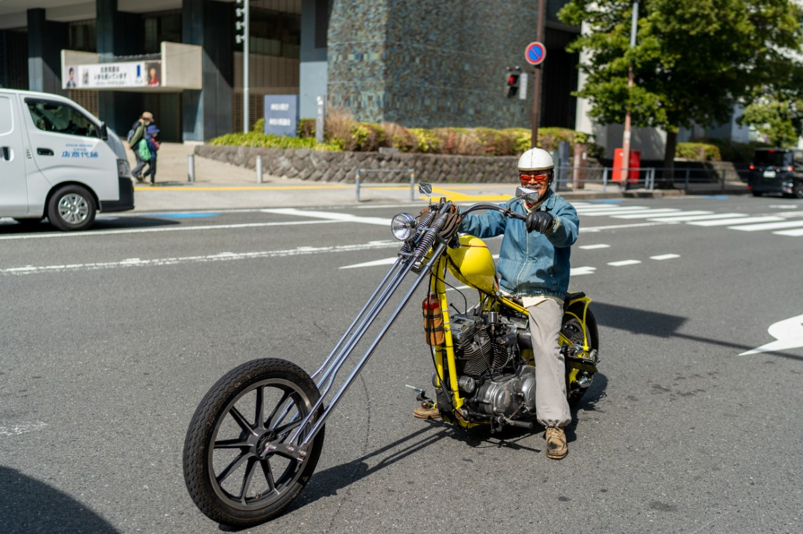

### 前言

　　這篇文章是 [shuojen](https://shuojen.com/) 在[留言區](/guestbook/)敲碗的「好奇學攝影的故事」，也藉由這主題談一下我從事新興趣的動機來源 XD

（2025/03/01 拍攝於日本橫濱）

### 內文

　　以前的我喜歡和人辯論。

　　學識越充足，越覺得「語言」很方便，可以用它來挑戰觀點、說服別人、回答問題。但隨著年紀增長，才漸漸發覺，這樣的方式無法回答自己的問題，對探索世界的作用也有限。

　　前陣子，我思考了許多藝術領域與 AI 間的關係，也寫了[我的 AI 使用手則](/thinking/my-ai-principles/)這篇文章。然而這段期間看到[一篇報導](https://hk.news.yahoo.com/%E5%A4%A7%E5%B9%85%E5%BA%A6%E4%BF%AE%E5%9C%96%E4%BD%9C%E5%93%81-%E8%B4%8F%E5%87%BA-sony-%E4%B8%96%E7%95%8C%E6%94%9D%E5%BD%B1%E7%8D%8E-%E5%B9%B4%E5%BA%A6%E9%9D%92%E5%B9%B4%E6%94%9D%E5%BD%B1%E5%B8%AB%EF%BC%9A%E9%80%99%E7%AE%97%E6%98%AF%E4%BD%9C%E5%BC%8A%E5%97%8E%EF%BC%9F-070411209.html)，以下引用自原文：

> 16歲的英國攝影師 Daniel Murray (@danieljm.visuals) ，去年奪得「Sony 世界攝影獎2024」年度青年攝影師大獎；他拍攝英國 Cornwall 海岸，一名滑浪手在暖黃色的陽光下，潮退時走過沙灘的寧靜畫面。數月後，他分享編輯照片過程，原照片內容經大幅修改，引起攝影圈熱烈討論。Murray 在社交媒體上貼出，原作超過 10 組人物和雜物，均他被用修圖軟件 Lightroom 移除掉。他主動把修改過的地方圈出，在自己得獎照片配以上述字句，更乘著熱度推銷自己的 Lightroom 調色濾鏡。
> 

　　不意外社群回文也吵成一團，有人認為「如果這樣也行，那不用走出家門直接在ＰＳ上畫畫也能叫攝影」、「所有蹲在那邊整天等完美畫面的攝影師都被當成白癡」，也有人認為「主辦都沒說話了，外行人不懂啦」、「出錢的最大」、「以前許多暗房時代的名作也有後製，沒道理現在不行」。

　　先別說攝影，在 AI 還沒出現前，音樂產業大概就經過洗禮，許多樂團[錄音內的作品超棒](https://www.youtube.com/watch?v=RRKJiM9Njr8)結果現場一團糟（原本想找~~精采~~影片結果好像被刪了），被戲稱沒有後製不會唱歌的「錄音室歌手」。就連現象級電吉他演奏家 [Ichika Nito](https://www.youtube.com/watch?v=DRfzittQ4Wc)，也被其他[職業樂手挑戰](https://www.youtube.com/watch?v=FWYPnJaOF0U)，認為他的音樂經過相當程度的後製，實際演奏水準遠遠不及他上傳的影片。YT 目前擁有一千多萬訂閱者的 Davie504 早在好幾年前，就用[幽默手法](https://www.youtube.com/watch?v=hkM94LgohKw)隱喻了流行音樂存在的問題。

　　從小彈古典鋼琴的我，最早也認為「音樂後製」是作弊。但隨著經驗知識的增長，雖然依舊是「保守派」，但核心想法已不比從前，理所當然[上架在 Spotify 的歌曲](https://open.spotify.com/album/155hGYwE9DG6WA5GU7LF8o?si=pNg7q7Y2QjSDE3GF8UNHRw)也經過相當程度的後製與混音。此時的我突然驚覺——

　　「我現在認為攝影不能Ｐ圖，是不是只是單純不懂攝影？」

　　想到這件事後，隨之而來的是更多的問題——好看的照片坐在電腦前一輩子也看不完，為什麼還要自己拍？當下用心體驗用眼睛看，應該比拍照更能專注當下吧？

　　參加動漫場次，我也是這樣想法。如果有想看的 coser 照片，只要場次一結束，不用自己拍就會一堆人發，或許有些人為了想認識 coser 所以成為攝影師，但我這種 I 人也沒有互動的需求，完全找不到理由。就算是那些生態攝影，能想到的物種丟到網路上搜尋，大概也有人拍好成千上萬的照片。扣掉各行各業總有想紅想賺錢，那些興趣使然的拍照人又是為了什麼？

　　啊。Actions speak louder than words.

　　「行動勝於言語」——其實我不太喜歡這樣的翻譯。雖然意思相近，但這樣翻其實比較像是「Actions better than words」。畢竟如果要「說」通常都是「話」，但「行動」居然能「說得比較大聲」，我認為原文隱含的轉化修辭，更饒富趣味一點。

　　根據以往的經驗，很多腦中產生的「為什麼」，多半得自己「行動」才能得到解答。就如同寫小說好玩在哪？攀岩好玩在哪？英雄聯盟好玩在哪？總要試試看才知道。

　　於是兩個月前，除了快門鍵以外的功能完全搞不清楚的我，抓著太太的 Olympus EP-7 相機，就這樣前往 FF46 同人場。雖然原本要在場內擺攤，但最終沒有新刊所以將攤位讓給香港朋友，兩天的時間，我多半時間得以逛逛場內的攤位，以及在場外拍照。我觀察著 Coser，觀察著那些攝影師，也一同擠進[伊織萌大型圍拍現場](https://www.youtube.com/watch?v=T81sozEC6EY)拍攝。

　　別人的答案終究是別人的經歷。比如說「為什麼學魔術」或「為什麼彈吉他」，青春期男生給的理由多半是「想給女生驚喜」、「想自彈自唱給女生聽」。

　　嗯，白話一點就是「把妹」。

　　但像我這種沒有把妹需求的~~中年大叔~~有為青年，這些藝術對我而言的意義在哪？

　　在藝術領域中，自己找出答案永遠比別人告訴你來得有趣，而且多半時候，別人的答案不見得是你的答案。經過了兩個月的「行動」，在攝影上的許多問題，我有了自己初步的答案。然而，進入了「見山不是山」的領域後，隨之而來的是更多的問題：

　　「街拍到底算不算偷拍？但如果每張照片都要被攝者同意，實務上根本不可能吧？所以先拍再說？」

　　「Coser 把臉修到看不出是誰 Cos 的照片有意義嗎？不對，但說到底 Cos 應該還是要『弄得像角色』，所以應該是合理的？Coser 追求的又是什麼？Coser 想看到的照片和我心中所想的『好照片』定義一樣嗎？」

　　我發現，我很享受這樣的「為什麼」。在追求答案的同時，每次按下快門的當下與事後，都有新的體悟。

　　「最好的表演體驗，永遠是下一次。」藝術不像運動，就算沒法彈得那麼快了，人生的閱歷可以讓想說的話在藝術領域上更有深度與力量，攝影完全是同一回事——「最好的拍照體驗，永遠是下一次的快門。」

　　當我在期待著那「下一次的快門」時，突然驚覺：

　　「原來這就是攝影的魅力啊。」