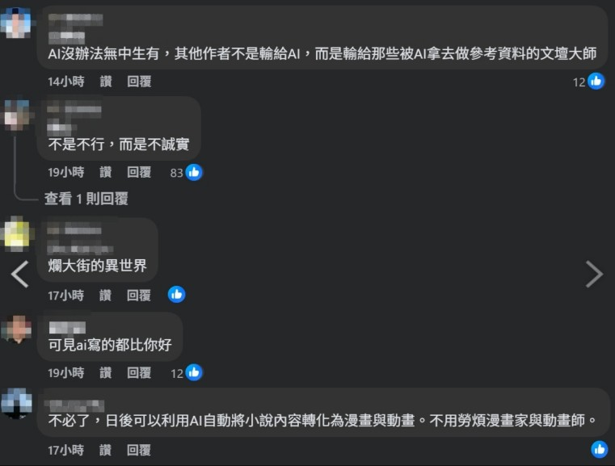

　　啊，其實是兩週[^1]。

　　原本打算一個月後再寫這件事，但就在昨天，我發現不用等到那麼久，現在就可以寫了。

　　剛刪掉 app 的時候，的確有出現戒斷症狀——無意識的打開手機，然後發現沒有 app 可以「按」，又默默關起手機。最好笑的是，我的小說裡[^2]有寫過一模一樣的場景：

> ……。最終，愛音還是將手機小心翼翼地握在手裡。她打開了手機，卻一時之間不知道該做些什麼，於是，又默默地收進了口袋。
> 

　　於是，我裝了 [Feedly](https://feedly.com/)。但比起用 RSS Reader 讀取文章，我更喜歡直接造訪網頁的感覺，所以 Feedly 就變成了我的「專屬 Blog 書籤 app」。平常滑 FB、X、Threads 的時間，就變成了在看其他人的 Blog。如果是坐在電腦前，省下來的時間我多半在寫作、閱讀和玩電腦遊戲。

　　最大的變化是，我發現世界變安靜了。

　　具體來說，我不再受到無建設性的隻字片語影響，腦袋想的都是「自己」或「別人」的思考。

　　舉個例子吧。就在剛剛，我看完了[《我覺得杜威十進位圖書分類法很好》](https://e89295.com/blog/2026-01-09_1.html)這篇文章。以下是實際發生的過程：

> - 我沒有很了解這個分類法，但直覺告訴我已經過時了，來看看他想說什麼。
> 
> - 原來如此，觀點很有趣，但我的想法差異挺大。不然來查查網路上其他人的討論好了。
> 
> - 嗯，查完了，我覺得絕對有更好的分類法。但不如說我這人就是討厭「分類」這件事，圖書館必須「分類」大概也是無可奈何之事。說到底如果要大改圖書館分類法，大概就跟「如何邊開飛機邊修飛機」一樣麻煩吧。
> 
> - 啊，先不管這個，我覺得這 Blog 的作者很有趣。除了文筆比我好之外，段落開頭有空格外還堅持對直排如此不友善的網路世界直排……或許光就排版就讓我想和這個作者好好交流 XD
> 
> - 等等，他的頁尾也很有趣，說什麼「你知道嗎？因為有伯恩公約，根本沒有必要在頁尾做版權宣告。」伯恩公約我記得台灣沒有加入吧？查了一下，嗯果然沒有，但有類似的著作權法去補充。
> 
> - 但無論如何，不喜歡在頁尾版權宣告的我，也覺得這個頁尾也很可愛。

　　我腦袋可以思考以上如此多的事情，我也稍微想像了文章作者大概是個怎樣的人。

　　如果這個議題在 Threads 上會怎樣呢？

　　「超扯居然有人不知道杜威十進位圖書分類法很好」

　　「有差嗎」

　　「誰還去圖書館 網路資訊還不夠多嗎」

　　「這分類法超爛 上次我去圖書館根本找不到書」

　　以前的我看到這些言論，腦中除了「網路留言平均水準到底能有多白癡」之外，沒有其他任何想法。

　　所以當我不看這些演算法平台後，再也沒人在我耳邊用這些話語爭吵。就算是爭論，也有個「論」字在裡面，沒有論點只有個人喜好，根本無法構成「討論」，也無法引發思考。

　　追根究柢，還是文章長短的問題。越複雜的事情，就得用更多的字去描述想法，這也是為什麼「微積分」、「工程數學」這類書籍~~都是拿來壓泡麵的利器~~，就因為不寫得那麼厚，無法精確說明裡面的知識一樣。在 Threads 上，我只知道這件事有人很喜歡，有人很討厭。但這些事情我本來就知道了，世界上任何一件事情都有人喜歡和討厭。我更想知道，你「為什麼」喜歡，「為什麼」討厭。

　　可惜因為演算法平台，大家越來越懶得討論「為什麼」了。沒人想看長篇大論，只想看情緒性質的表演。

　　或許我早該意識到，這種地方不適合我。我更適合好好看完一篇能清楚表達作者心中想法的文章。這或許讓我更認識世界，更相信自己的價值觀，就算都沒有也都沒關係，有時只是會心一笑也好。演算法平台不是沒有這類文章，但比例實在太低了。低到在看到那些文章前，就會被雜音給淹沒。

　　「這樣安靜的世界，不會太無聊了嗎？」

　　我只想說，那些平台底下毫無建設性、只會嫌東嫌西的留言到底哪裡比較不無聊 XD

（為了找素材特地開了 FB，結果大概五秒就找到了）

[^1]: 標題的算法是架好 Blog 開始寫文的時間點，但兩週前計劃準備脫離演算法平台時，我就直接將手機的所有平台 app 刪了。

[^2]: 出自[《休止符間的隱形記號》（千早愛音生日賀文）](https://www.pixiv.net/novel/show.php?id=25837626)