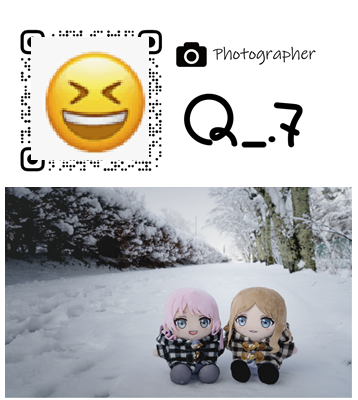
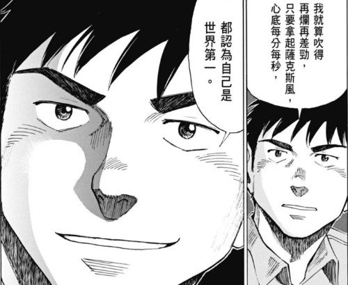

## 前言

　　不知道大家聽到「生產力」這名詞，第一個想法是什麼呢？

　　每個人對生產力的定義或許略有出入，如果不先講好可能就會雞同鴨講。所以在此自行定義了一番：一個人的生產力越高，表示能在越短的時間內，達到想要的目標，或花較長的時間，但能做出品質精良的事物。例如，別人一小時採三箱葡萄我採了五箱，或者同樣採了三箱，但我的葡萄修枝[^1]修得特別漂亮，顧客買到我的葡萄會更開心，這兩者都是優秀的生產力表現。也因此，「生產力常數」或許就是：

　　

$$
\text{生產力常數}=\frac{\text{數量}\times\text{品質}}{\text{單位時間}}
$$

　　

　　有了定義，就能開始聊聊「生產力」這件事了。本文將以「成為專業人士」為主題，分成不同的兩個面相探討生產力這件事。這也是我「[BlogBlog 同樂會 - 2026 年 4 月](https://blogblog.club/party)」投稿文章，如果你有自己的部落格，歡迎一起來參加！

　　

## 上篇——成為專業人士

　　前陣子我想印新名片。

　　以往我的名片設計都只出一張嘴，交給專業平面設計師（aka 我太太）搞定。但前陣子她特別忙，表示沒多餘時間弄我的玩具~~或者單純不想搞這種毫無生產力的事情~~。好吧，反正這次沒要搞太複雜的圖，只是弄個 QRcode 和文字，自己學一下 Illustrator 是能有多難？

　　結果光是拉出對齊的直線和眼花撩亂的快捷鍵功能，就快把我搞瘋。「專業平面設計師」在一旁看不下去，指指點點比手畫腳，一小時過去好不容易搞了個雛形，物件卻怎樣也對不齊。

　　「啊，還是剩下的妳快速幫我用一下啦 🥹」

　　專業設計師嘆了一口氣。我將 ai 檔傳過去短短不到五分鐘，已經排完丟去送印了。

　　（名片就這樣而已。現在想想以拉就像其他 Adobe 系列一樣得認真學習，不像 [canva](https://www.canva.com/zh_tw/) 那樣傻瓜友善）

　　專業人士無論工具的使用效率、想法與經驗都遠遠超越了一般人，並且能花更少的時間，產出更有品質的成果。專業攝影師能快速理解手上相機的優勢與缺點，在同一個場景憑經驗能立刻決定構圖，拍人像時也能快速引導模特姿勢。新手花一個下午按了數百次快門都不一定能出現的好照片，專業攝影師可能只需短短幾分鐘就能完成。同理，業餘鋼琴愛好者練習許久才能勉強彈完一遍的曲子，專業演奏家視譜就能彈得更好，甚至能同時詮釋樂句情緒。

　　所以生產力的根本，就是「專業程度」。就算不是專業人士，想辦法讓自己更接近專業，正是提升生產力的關鍵條件。

　　那麼，如何讓自己更專業？

　　接著我將分成「心態」、「思考」、「行為」三個層面，聊聊我的看法。

### 一、心態

> 「就算吹得再爛再差勁，只要拿起薩克斯風，無論何時我都認為自己是世界第一。」
> 

　　這是描寫爵士樂團漫畫[《Blue Giant》](https://zh.wikipedia.org/zh-tw/BLUE_GIANT_%E8%97%8D%E8%89%B2%E5%B7%A8%E6%98%9F)裡主角宮本大，在同團的鋼琴手陷入低潮時~~嗆~~鼓勵他的一段話。讓自己更專業的第一步，就是先「相信」自己是專業人士。就算現在不是，以後也是，正在做這件事情的自己也是。這概念的原型，是學魔術時其中的表演理論：「表演時的心態不只影響他人，還會影響自己。就算第一次變給觀眾看的魔術，心態上必須像是早就變過幾百次一樣。」

　　就在某天，我發現這理論套在學習道路上也完全相同。若能想像自己是專業人士，看待錯誤、挫折和練習的方式也會不同。就算我沒打算成為職業攝影師，但拿起相機時「我就是世界上最會拍照的人」、「現在的我會拍出世界上最好的照片」，這樣的想像，的確影響了我的拍攝成果。

　　有人認為這樣的想法很有壓力，但就和智揚[〈我的時薪〉](https://chihyang.cc/posts/my-hour-rate/)內闡述的道理一樣，只是心態上的不同而已。心態影響思考，思考影響行為，現實中無論是否能成為世界第一，先成為自己心中的世界第一，我認為是非常重要的事。

　　（[《Blue Giant》](https://zh.wikipedia.org/zh-tw/BLUE_GIANT_%E8%97%8D%E8%89%B2%E5%B7%A8%E6%98%9F)最喜歡的一段話。圖片僅供學術研究參考）

### 二、思考

　　「學而不思則罔」——有時候，我更認為是「做」而不思則罔。

　　以前沉迷廚藝時，看到某位廚師這樣說：「如果你家裡晚餐都是媽媽或其他長輩煮的，那有想過為什麼他們煮了幾十年，卻沒變成米其林大廚嗎？」

　　雖然有點偏激，但還真是一語點醒夢中人。學生時期家裡常開伙，但我媽煮的飯婉轉地形容是「口味清淡」，我知道其他人家長輩可能都有些拿手菜，但我媽沒有。她就這樣做了很久的菜，的確也沒有變成大廚。

　　依稀記得我抱怨過家裡的菜都沒味道，據她的說法是「少放調味料這樣比較健康，沒味道也是正常」，但自己開始學做菜後，才知道就算是少放調味料突顯食材原味的料理方式，也能弄出好吃的菜（例如黑白大廚２的寺剎飲食），只是我媽不知道而已。更精確的說法是我媽也沒有想知道，因為「如何把菜做得更好吃」不在她的思考範圍內。

　　從這之後，偶爾會反思自己的「專業」是真有十幾年的經驗，還是只用幾天的經驗，做了十幾年而已。

　　那麼具體而言，該如何「思考」呢？

　　著名演員 Al Pacino 回憶起已故好友 John Cazale 時表示， John Cazale 在表演的時候能完全變成任何角色的技巧，就是問問題。「他教我要不斷問問題，但不必有答案，就是這表演技巧的精隨。」

　　（左：John Cazale 右：Al Pacino）

　　我非常同意。「思考」的重點就是「問自己問題」。開始學攝影時，從最最基本的「為什麼想學攝影」、「想成為怎樣的攝影師」、「想拍出怎樣的照片」，到開始之後的「我喜歡怎樣的照片」、「我現在拍的照片和那些我喜歡的照片差在哪」、「為什麼我覺得這張照片好看」、「為什麼我不喜歡這張照片」等，無論是籠統或者專業技術向的問題，都在腦中盡量發問。

　　這樣一來，在「學」與「做」的時候，就有方向可以尋找答案，目標也更明確。

　　就算思考、學習與實作三者間相輔相成，也得先有思考（也就是疑問），才知道要「學」什麼與「做」什麼。

### 三、行為（學習與實作）

　　如何正確的學習坊間已有許多不錯的書籍，如先前在[〈後設寫作法〉](/writing/post-writing/)中提過的《超速學習》這本書，這裡就不再贅述。但有句我認為非常有道理的話：

　　「現在這世代缺的已不是『Data』，而是『Information』。世界上已有無限的資料，但未經整理就只是資料而已，真正值得學習與參考的，是有用的『資訊』。」

　　無論是自學或參與課程學習，事半功倍的訣竅就是分辨哪些是「對自己有用的資訊」。而「自學」最難的部分就是必須自己分辨有用的資訊，因為沒用的免費資訊還是佔了絕大多數（除了 [好和弦](https://nicechord.com/) 之類的優質頻道）。這也是為什麼付費或者找老師學習通常效率更高的原因，因為專業課程設計者已將他認為的「有用資訊」整理好，私人家教更可以幫人量身訂有用資訊，效率更高。

　　但如果有時間，我依舊推薦保有一定程度比例的自學空間。理由也非常簡單，2026年的今天，「如何分辨有用資訊」這項技能只會越來越稀有，在自學過程中遇到的困難與瓶頸，都會成為往後更快分辨資訊好壞的糧食。

　　

## 下篇——成為專業人士之後

　　一名紐約商人，在墨西哥度假時和一位當地的漁夫聊天。

　　漁夫說自己一天只工作一下子，剩下的時間則曬曬太陽，喝喝酒，和朋友玩音樂。這樣的時間管理方式嚇到了紐約商人，商人主動向魚夫解釋，如果他更努力工作，就能把利潤拿去投資，組成大型船隊，之後就可以付錢請別人去捕魚，然後就早早退休，再也不用工作了。

　　「那接下來我要做什麼？」漁夫問。

　　「嗯，這個嘛，」商人回答：「你就可以曬曬太陽，喝喝酒，和朋友玩音樂。」

　　（出自《人生的四千個禮拜》之短篇小故事， Oliver Burkeman 著）

　　過年時我帶了相機到親戚家作客。親戚年輕時也非常喜歡拍照，知道我也開始拍照後非常興奮，拿了許多珍藏的攝影集和雜誌給我看，也分享了許多拍照的心得。

　　他想拿拿看我的相機，可惜雖然年事已高受到巴金森氏症所苦，全片幅相機的重量對他而言已經沒辦法拿穩了。

　　幾年前看了已故紙牌魔術之父 Dai Vernon 晚年的訪談影片，片中他興高采烈地對那些（絕大多數是他發明的）魔術效果如數家珍，但在中間他拿起紙牌後又突然放下，快速地穿插了一句：

　　「啊，可惜我現在的手什麼都做不了。」

　　Dai Vernon 在講這句話的時候只是輕描淡寫帶過，但不禁讓我嘆了一口氣——

　　Time waits for no one.

　　（圖片出自《跳躍吧！時空少女》，僅供學術研究參考）

　　成為專業人士後，必須先想想自己的「生產」是為了什麼，更白話一點：「我們的人生是為了什麼」。前陣子半開玩笑地和朋友表示，如果人生非得為了賺錢而去做沒那麼喜歡的工作，那應該畢業出社會後就先退休，然後５０歲再開始工作到離世比較合理。

　　上週四大學球隊的兩位同學特地「路過」南部，久違一起打了場羽球。場邊閒聊時一位同學表示他終於換了工作，笑著說突然可以做更多的事（例如突然跑來打球）好不習慣。

　　朋友身處台灣資訊產業中最賺錢的那塊（偷偷算了一下我的年薪或許沒有他繳的稅多），高壓的環境一天工作十二小時也是家常便飯。但是到這個年紀，大部分同學們漸漸搞懂自己真正想要的生活後，不約而同也會發現「人生或許不需要這麼急著生產」。

　　「年輕時努力工作退休後享清福」或許就是人生最大一場騙局。

　　本來無「清福」，何處惹塵埃？現在我的眼睛能看清楚電腦螢幕，雙手流暢地打著這篇文章，假日抓著相機單手撐著跳過欄杆拍照，或許已是最大的「清福」了。如果人生黃金青春歲月奉獻給（不那麼喜歡）的工作，退休後能做的事情，或許也沒想像中那麼多。

　　「如果想種一棵樹，最好的時機是二十年前，其次是現在。」

　　畢竟無論看了多少書及文章，只要提到[死前最後悔的事](https://wiwi.blog/blog/five-regrets/)，從來沒有人寫過「後悔沒多賺點錢」。我甚至認為，應該也沒有人會寫到「後悔這輩子生產力不足」，大家後悔的多半是那些「現在的我們」早就能做到的事。因此成為專業人士後，找到屬於自己「曬曬太陽，喝喝酒，玩音樂」的理想日常[^2]，我認為比起「埋頭生產」重要許多。

　　畢竟在這個生產力早已過剩的 2026 年，還那麼急著生產，幹嘛呢？

　　

## 後記

　　AI 興起後，以前要寫兩個月的程式現在只需要兩天，以前要錄一個月的歌現在一小時就能產出，以前要畫 20 小時的圖現在 20 秒就能出現一張。

　　但人類並沒有因此變得比較清閒。「啊，因為我兩天就做完以前得做兩個月的工作， 所以剩下的 58 天終於可以悠哉度日了！」

　　如果你和我一樣是受薪階級，應該也能同意立希的說法。

　　人類社會就像是一台無法踩剎車的巴士，開在一台沒人能確定要去哪裡的道路上。或許社會的完美想像是「當更有效率，更有生產力的時候，我們就能更輕鬆度日，有更快樂的生活，更多的資源能分配到更多的人，世界也更容易邁向大同。」

　　有嗎？你覺得呢？

[^1]: 無用知識：葡萄採收裝袋前，要把掛有小葡萄的雜枝修掉，整個葡萄才會像賣場看到的那樣美觀。如果求快隨便修就亂裝袋，會被稽查員記在小本本然後隔天被解雇（很嚴苛）。
[^2]: 這是[三月 Blogblog 同樂會](https://alexhsu.com/perfect-days-2)主題，快去看看大家的理想日常吧！