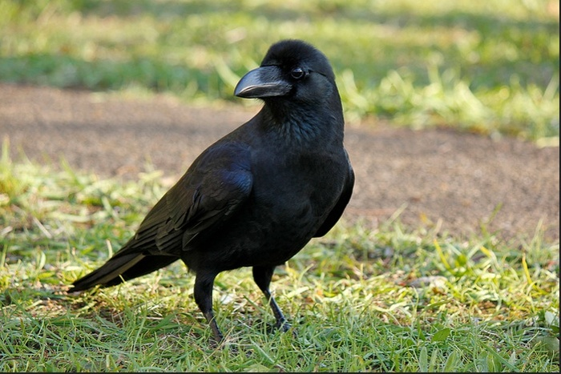
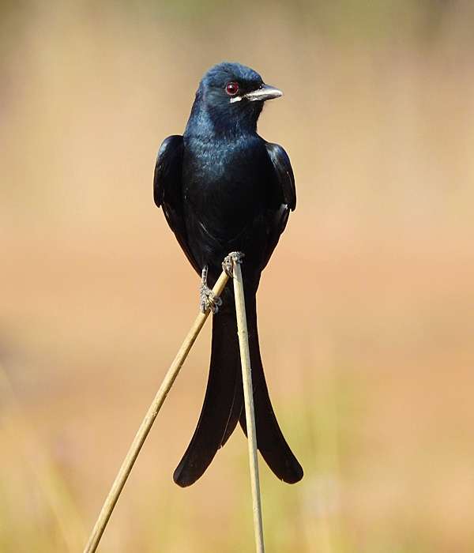
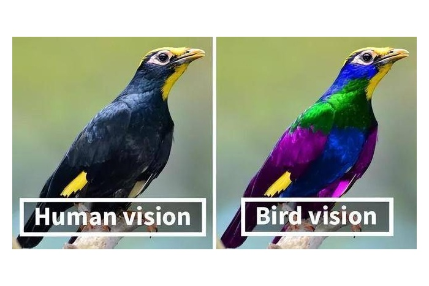
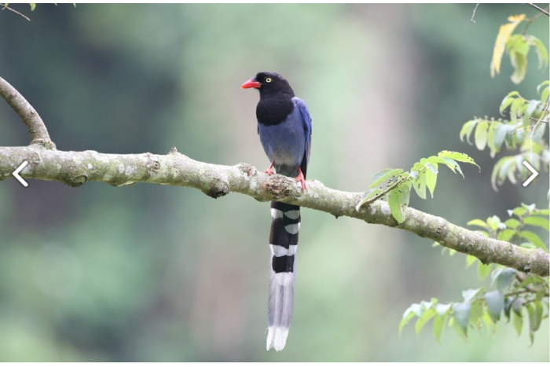

　　上週打羽球時，在[場邊腦內規劃](/mood/thursday-badminton-4/)七月同樂會主題的想法，原本想找到「就算是專業人士也沒辦法發現」的冷知識，但實在太難了。

　　轉念一想，或許可以改為介紹「自己有興趣的知識」。就如同魔術師 Derren Brown 表示：「由於為朋友挑生日禮物還要猜對方想要什麼太麻煩了。」他的做法是，先挑好禮物，再想辦法讓對方覺得自己想要這個禮物就好[^1]。

　　知識大概也是這樣。雖然一開始是「沒人在乎」的知識，但如果想辦法用文章引發別人的興趣，那麼這知識也就不那麼「沒人在乎」了，不是很棒嘛！

　　所以，今天這篇文章，打算來聊聊關於「鴉」的一些有趣知識。

## 烏鴉

　　（Photo: [Anne Kurasawa](https://www.flickr.com/photos/akurashashin/6906078972/in/photolist-bwgsF7-rJX7Uz-rqBQ4i-qR9FjU-rJX81X-qDVibc-ksBp77-acy1qG-4H8xsN-g4a24R-pBFsFB-pBFsNv-aNwRAz-jHRZki-jHRZp6-pBFsBt-bhnZ3g-pBFsSt-jHRZwa-4b6dQp-baus1n-7XgpVh-9JYrSj-iU6ZeY-pjJZ1w-7k55jd-crkQAy-dpPZVq-fEACWv-9ZN8AS-q2CEaf-fwqaTv-7eKZgK-5MB779-pjJYZE-bmeU4m-bg8m44-gmYWzo-5AbTkA-67QsrW-9rxC3G-67QsdG-5A7BZr-dTPDjP-5A7CuK-iU6Z7d-6F1vkj-bnV3By-bJRDgX-nsokTG)）

　　說到烏鴉，大家想像的應該是如上圖所示，全身黑漆漆的樣子。其實如果是「烏鴉」，在台灣都市中不算常見。但只要出國，無論歐美、澳洲甚至日本，在都市內都容易見到牠的蹤影，早些年去澳洲打工旅遊時，半夜三點烏鴉直接飛到窗邊叫你起床尿尿，也是獨特的經歷。

　　那麼關於烏鴉，有什麼冷知識呢？

## 烏鴉很聰明

　　「這哪是冷知識！連我阿嬤都知道！」

　　也對，因為大家小時候或許都聽過，烏鴉為了喝到瓶子裡的水，會將石頭慢慢填滿水瓶的寓言故事。所有「鴉科」的鳥類，都擁有非常高的邏輯推理能力與智商，堪比鳥界愛因斯坦。

　　事實上，烏鴉的聰明程度遠遠比「丟石頭喝水」來得更誇張一點。為了找些實例證據，就發現了這個精采影片：



　

　　烏鴉甚至會玩密室逃脫！！！如果有辦法操控滑鼠，真想讓牠見識一下 [Neutral 的作品](/mood/neutral-room-escape-games/)。上面的影片，應該也超乎多數人對烏鴉智力的想像，人類們，再不好好努力，工作就會被邊牧[^2]和烏鴉取代了啊！（聽起來很棒？）

## 烏鴉的叫聲

　　「烏鴉的叫聲怎麼了嗎？不就嘎嘎嘎很難聽？」

　　是這樣沒錯，但不是這樣.jpg。

　　鴉科被分類在「雀亞目」（Passeri）底下，「雀亞目」又名「鳴禽亞目」。

　　沒錯，既然是「鳴禽」，就代表牠們其實是發聲界的高手！這些鳥多半擁有發育完美的發聲氣管，而且有 5 到 7 對獨立控制發出聲音的肌肉，其他大部分鳥類只有 1 到 2 對，甚至沒有。大家以為最廣為熟知會講人話的鸚鵡，也只有 2 到 3 對能控制聲音的肌肉而已[^3]。

　　什麼？你問我那為什麼烏鴉只會嘎嘎嘎的叫？

　　藝術是主觀的啊。搞不好它們覺得那樣叫很好聽，幹嘛這樣。而且還記得烏鴉很聰明嗎？聰明的最高境界就是大智若愚，如果叫得太好聽被人類抓去工作了怎辦？（誤）

　　事實上，多數鴉科是高度社會化的群居動物。對於烏鴉來說，牠們有幾十種不同的「嘎」，代表不同的指令（發現食物、有危險、撤退、進攻）。所以基本上，就算牠們能，沒事也不會輕易模仿別種鳥類的叫聲。

　　「不是不做，只是不想做」，這根本就是酸烏鴉心態！（啥）

　　唉，只好眼見為憑了。雖然鴉科鳥類因為太過聰明不太適合當寵物鳥，但如果被人類飼養，牠們的模仿能力比鸚鵡還有過之而無不及，甚至極難辨認到底是不是真的人類在說話還是咳嗽：



　

　　很驚人吧？別小看高智商的「鳴禽亞目」啊。

## 大卷尾

　　也因此，台灣常見且國外俗稱「King Crow」（鴉王）的大卷尾（台灣俗稱「烏秋」），會將這天賦用在非常實際的地方，也就是牠們會模仿猛禽的聲音，讓其他鳥誤以為猛禽來了準備逃跑，而獨佔地盤，聰明到有點狡詐。



　　（影片內為近親小卷尾模仿松雀鷹的叫聲。小卷尾因為生活在山上，較常使用這種技能）

　　那麼，冷知識在哪呢？

　　就是俗稱「鴉王」的大卷尾，根本就不是「鴉科」，而是「卷尾科」！

　　科別不同，代表的就是他們習性不同，也就是說牠們在生物學上，反而比較像是長得比較大隻的「鶲科」鳥類，可以精準地在空中捕捉到昆蟲。被誤認為「King Crow」的原因，是因為牠們除了一身黑，又和鴉科一樣聰明，趨同演化[^4]導致。

## 烏鴉的顏色

　　「不就是黑色？我知道還有一些黑白相間的啦。」

　　冰雪聰明的各位如果看完上面影片的確會發現，有些烏鴉的確是黑白相間的顏色，比如說影片中密室逃脫的那隻應該是非洲白頸鴉，身上就有很酷炫的白色圍巾。

　　但其實真正的冷知識是，烏鴉身上的黑色其實不是黑色。

　　「蛤？」

　　雖然我們看到的是黑色，但我們每個人手上拿到的地圖不同[^5]，更何況是「人類」和「鳥類」。如果我們仔細看，可以發現烏鴉或大卷尾的「黑」其實有一層淡淡的金屬反射光澤，其實，只是我們人類的辨色能力太弱。幾乎所有的鳥類都有「四色視覺」，也就是說，比起人類牠們的眼睛還能接受「UV光」，也因此，牠們彼此眼裡的對方根本不是純黑色，而是非常漂亮的彩色，如下圖。

　　也就是說烏鴉身上的那層金屬光澤加上紫外光反射之後，在鳥類世界而言，烏鴉的顏色應該跟五色鳥差不多炫炮才對。這還有另一個演化上的好處，就是對天敵（貓狗哺乳類）而言，我們看到的就只有一團黑，但對求偶而言，卻能用來確認同類身體健康程度。很酷吧？

## 台灣都市中的鴉科

　　最後，其實台灣都市中也能見到鴉科，比如說，台灣藍鵲。

　　「Ｘ，騙我！名字內根本沒有鴉！」

　　沒錯，以前的人只要看到一隻鳥體型中等、身形修長而且有著一根漂亮的長尾，就會在牠的名字裡塞個「鵲」字，除了台灣藍鵲，喜鵲也被分在鴉科裡面。而且喜鵲也是少數能通過「鏡子測試」的鳥類。[^7]

　　這樣一來，大家應該知道為什麼台灣藍鵲這麼兇了，因為牠們是高智商又成群結隊的聰明鳥鳥。育雛繁殖期不只是人類，連就算食物鏈血脈壓制的天敵猛禽都敢成群結隊對著幹，被戲稱鳥界８９。我住的城市相對沒那麼容易看到台灣藍鵲，但如果是住台北，應該是都市內較容易見到的國寶級鳥類。

## 總結

　　幫大家總結一下本期的鴉科冷知識們：

- 烏鴉很聰明，它的邏輯推理能力甚至是一個五到七歲的小孩。同為鴉科的喜鵲甚至能通過鏡子測試。[^7]
- 所有鴉科叫聲難聽只是不屑唱歌給我們聽，不是不能唱。當牠們真想模仿人類說話時，比鸚鵡還難分。
- 烏鴉對人類來說是黑色，但對牠們自己而言不是，而是類似五色鳥那樣絢麗的顏色。
- 台灣都市常見的大卷尾，聰明程度和習性都被誤認為「鴉王」，但其實不是「鴉」，而是「卷尾科」。大卷尾甚至和「王鶲科」的「[黑枕藍鶲](https://zh.wikipedia.org/zh-tw/%E9%BB%91%E6%9E%95%E7%8E%8B%E9%B6%B2)」比較親，很難想像。

　　以後在路上看到烏鴉、大卷尾或台灣藍鵲，可以和一旁的朋友打開話題，分享以上的有趣知識喔！當朋友訝異你怎麼懂得這麼多時，你就可以大方說因為我有在看 LQ7 的 Blog，呃不是，因為我有在關注「[BlogBlog 同樂會 - 2026 年 7 月](https://blogblog.club/party/) 」的投稿文章，裡面有更多有趣的冷知識。

　　而這篇理所當然也是我的七月投稿文章，本月主題是「[有趣的小知識或冷門概念](https://shuaixin.cc/Fun-Fact/)」，由[劉昕](https://shuaixin.cc/)主持。如果你有自己的部落格，歡迎一起來參加！

[^1]: 這聽起來很不可思議，但這魔術讓我更加篤定所謂的「自由選擇」或「自由意志」實在是虛無縹緲，以後再細說 XD。（忽然發現以前文章內許多「以後再細說」的部分好像都不了了之，我會檢討）（完全沒要檢討的意思）

[^2]: 「邊牧是邊牧，狗是狗」——所言不假。

[^3]: 鸚鵡之所以這麼會講人話，是因為~~運氣好~~舌頭很像人類的構造，加上大腦也很強的關係。

[^4]: 趨同演化（英語：Convergent evolution），也稱收斂進化，是指兩類在親緣關係上很遠的生物，因為長期處於相似的生活環境而演化出相似的特徵。（[維基百科](https://zh.wikipedia.org/zh-tw/%E8%B6%8B%E5%90%8C%E6%BC%94%E5%8C%96)）

[^5]: [地圖不等於疆域](https://www.wen-lab.tw/map-territory/) by Wen的生產力實驗室。

[^6]: [這篇文章](/writing/e-mail-or-email/)內有圖，可前往欣賞立希的盛世美顏。（啥）

[^7]: 喜鵲是少數能通過「鏡子測試」[^8]的非哺乳類動物。其他鴉科雖然沒有測試證據，但以聰明程度，我猜應該也可以。

[^8]: 鏡子測試（英語：Mirror test），又稱鏡中測試，是一個自我認知能力的測試，它基於動物是否有能力辨別自己在鏡子中的影像而完成。（[維基百科](https://zh.wikipedia.org/zh-tw/%E9%95%9C%E5%AD%90%E6%B5%8B%E8%AF%95)）