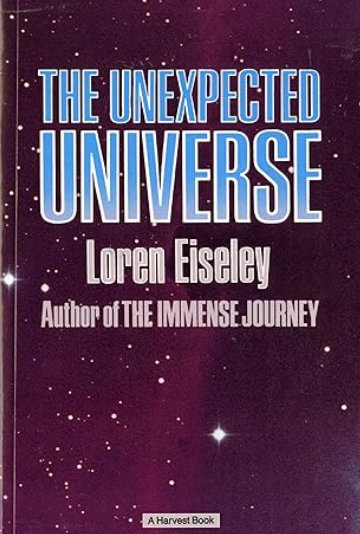

## 前言

　　這是一個寓言故事，名叫《丟擲海星的人》，但翻成《擲星者》也不錯（真正的原文有點雙關）。或許不少人也聽過這個故事，因為很常出現在英文課外閱讀教材裡面。故事是這樣的（LQ7 重述版本）：

---

　　一位老人去海邊散步時，遇見了另一位年輕人。他不斷彎腰撿起海星，然後用力將他丟進海裡。老人好奇上前詢問：

　　「早安，請問你在做什麼呢？」

　　「我正把海星丟回海裡。」

　　「為什麼要把海星丟回海裡？」

　　「太陽升起後潮水正在退去。如果不把海星丟回去，牠們就會死掉。」

　　聽到這番話，老人笑了笑：「年輕人，難道你不知道到這整片幾英里的沙灘有多少海星嗎？這樣做根本沒有任何差別。」

　　年輕人再次撿起了另一隻海星，將牠用力丟回大海。當海星落入水中的那一刻，他回答道：

　　「有差別，對剛剛的那隻來說。」

---

　　[查到的英文內容](https://mnpsychconsulthub.com/the-star-thrower/)和我記憶中相去不遠，有興趣可以自行閱讀。但其實這不是真正的原文，而是被大幅改寫過的精簡版本。原文出自 Loren Eiseley 1969 年的《The Unexpected Universe》裡面名為〈The Star Thrower〉的散文，篇幅遠比上面的長，而主角正是作者本人，原文表現得更哲學，也加著重於描寫大自然的孤獨感與自己的內心戲。

　　以下是 LQ7 的大綱說書版本。

　

## 《擲星者》原作繁體中文細綱

　　原文以作者第一人稱視角敘述進行。

　　他以為自己是個教師，卻常常發現真正被教導的人其實是他自己。他形容自己是個「帶著眼睛的骷髏」，因為在科學的眼中，世界的一切依照大自然的法則：冷酷、混沌且適者生存。

　　某天他來到了科斯塔貝爾的海灘，發現這裡堆滿生命的殘骸。寄居蟹原本該在深水裡尋找新家，卻赤裸地被海浪拋上沙灘，在空中等候的海鷗，便伺機將牠們撕碎。那潮間帶就是巨大的死亡步道，但就算是這樣，仍有許多小生命掙扎著想回到孕育並保護它們的大海。

　　但，大海最終會拒絕自己的孩子們。

　　不管海星再怎麼爬，終究無法抵抗一次又一次把它們推回岸上的浪，牠們的呼吸孔被沙塞住，升起的太陽也使牠們的身體漸漸乾縮。[^1]

　　不只是這些大自然的力量，作者也發現另一種像是「禿鷹」的活動，因為科斯塔貝爾海灘有許多「職業撿貝者」。他們專門蒐集被沖上岸的貝殼與海星，撿回去後將他們丟進大鍋煮熟後，清理成標本。

　　作者沿著海岸一路行走，看著這些海螺殼、遠處木材的殘骸以及糾纏在一起的海草。最後，他在海岸的遠處遇到了「擲星者」。

　　作者以為這人同樣是要撿貝殼回去賣，所以在看到他把地上的海星撿起來時說了「牠還活著」這樣的話。

　　「是的。」那年輕人將海星拋入海中：「牠也許能活，只要離岸的力氣夠強。」

　　作者此時才意識到他可能誤會了這位年輕人，所以有點尷尬地找尋著能接話的方法：「很少有人走到這麼遠。你是在岸邊的殘骸裡收集還活著的東西嗎？」

　　「而且只收集活著的。」年輕人回答：「人類能幫助牠們。」

　　作者聽到這些話後有點不自在，於是這樣回話：「我不收集。活的我不收，死的也不收。我很久以前就放棄了。死亡才是唯一的收藏家。」

　　兩人結束了對話後，作者走回旅館的同時，自己也思考了許多的事情。

　　接下來的一整個篇幅，就是 Loren Eiseley 最精彩的自我思辨，包括提到了他已過世的母親，看著岸邊那些正在煮沸的大鍋，人類的歷史與進化，達爾文與佛洛伊德主義，精彩到 LQ7 放棄轉述，真是抱歉。

　　最後，他決定再次去尋找那位年輕人。他原本認為他是觀察者，也是科學家，但最後，他找到了「擲星者」後，撿起一顆仍活著的海星，把它丟向遠處的大海。

　　「我明白了，」作者說：「也算我一份吧。」

　　此時的作者，才允許自己開始想：「他不再孤單了。我們之後，還會有別的人。」

## 後記

　　故事最後作者有做了一個很美麗的結尾。但我認為停在這裡也是不錯。

　　改寫過的短文和原文相比，我更喜歡《The Star Thrower》真正的原文。但原本改寫的短文，其實我也很喜歡，也是因為這樣想要找原本的短文，意外得知這個故事其實原文比想像中的長非常多。但兩者我認為想要表達的意境不同，雖然是同一件事，但卻不是同一件事，大概已經可以當成不同的文章來看了。

　　不知道各位讀者覺得這（兩個）故事如何？

　　如果有辦法看原文的建議[直接看pdf原文](http://www.brontaylor.com/courses/pdf/Eiseley--StarThrower.pdf)，或寄信找我索取原文的文字檔版本後請人（？）翻譯，相信會更有韻味。

## 後記２

　　最近在研究鳥類。原本這篇文章是打算講關於原生種外來種例如「家八哥」、「白尾八哥」、「本土八哥」的想法，事實上原生或外來種也只是人類自以為的分類而已。「家八哥」不會自己知道自己是「外來種」，大家都是基因的奴隸[^2]，早起出門覓食，繁衍後代，想要生活下去，就和那些綠鬣蜥一樣吧。

　　忽然想到人類還真好意思說綠鬣蜥氾濫成災，最氾濫成災的不就是人類自己嗎。

　　然後就想到這個海星的故事了。整篇離題，但離得很美我覺得（還真好意思 again）。

[^1]: 這段原文寫得美到殘酷又震撼，於是其中幾句我照原文盡量細微地翻譯並重組了一下。

[^2]: [讀書筆記：《機器人叛亂：在達爾文時代找到意義》](https://shuaixin.cc/The-Robots-Rebellion/)By [劉昕](https://shuaixin.cc/hello/)