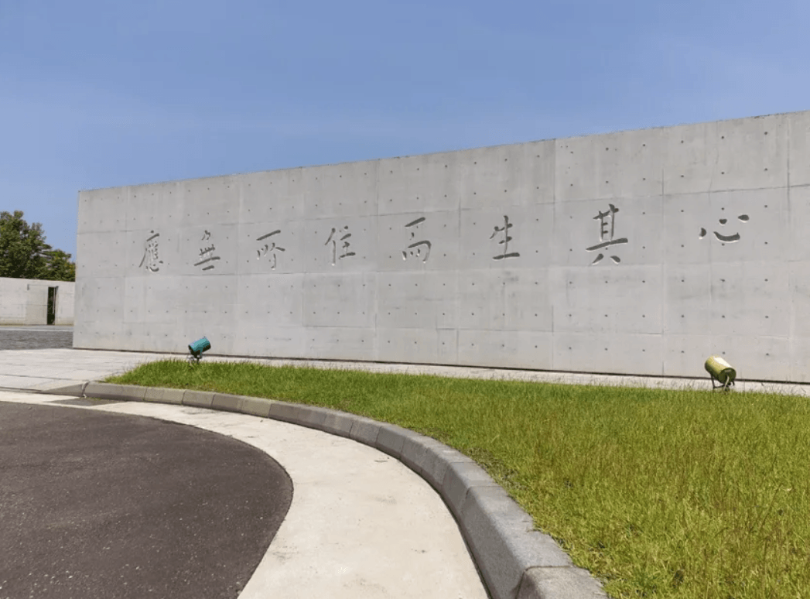

　　讓我說個六祖惠能的故事。

　　有一天，五祖打算將衣缽傳下去，於是召集了弟子們，希望他們各自發表見解，如果有領悟佛法的人，就要立他為六祖。一位名叫「神秀」的人，是寺院裡面為他人講解佛法並帶領其他弟子修行的講師。大家都認為他應是最接近祖位的人，所以其他人都在等他作偈。最後，他在堂前寫下了這段偈子：

> 「身是菩提樹，心如明鏡台，時時勤拂拭，莫使惹塵埃。」
> 

　　五祖看了後雖然沒特別滿意，但時常這樣修行也能避免走入邪道，所以就叫大家誦念。結果，這段偈子被在後院工作的惠能聽到了，便請人帶他到堂前，寫下了他自己的偈子：

> 「菩提本無樹，明鏡亦非台，本來無一物，何處惹塵埃？」
> 

　　故事就到這邊結束了。欲知後續詳情請付費訂閱，呃不是，請點閱[禪宗六祖惠能大師](https://www.ctworld.org.tw/chan_master/east006-0.htm)，裡面有完整的故事。

　　[五月的 BlogBlog 同樂會](https://eddielv.com/articles/a-sentence-changing-you/)如果沒有拿[斯多葛哲學](/thinking/we-suffer-more-often-in-imagination-than-in-reality/)參戰，那我大概會拿六祖惠能的這段話，或是刻在法鼓山門口金剛經裡面最重要的八個字——「應無所住，而生其心」參戰。

　　（農禪寺大門，圖片出自[這裡](https://woman.udn.com/woman/story/123162/7345338)）

　　我不打算花太多篇幅解釋這兩句話，但最近看到的議題，大部分都是「時時勤拂拭，莫使惹塵埃」的呼籲。如果真要做些註解，我只能說：

> 「人啊，生不帶來，死不帶走。」
> 

　　因為本來無一物，所以留不留下，其實也沒那麼重要。

　　和黑人朋友混得很熟的[實況主 Ray](https://zh.wikipedia.org/zh-tw/Ray_(%E8%87%BA%E7%81%A3YouTuber))，某次比賽後獲得了銀牌獎牌，打算把它直接送給場邊的觀眾。旁邊同隊的朋友非常驚訝，立刻將他拉過來說「這是回憶啊」，示意不要輕易送出去，但 Ray 卻指了指鏡頭，表示「我的回憶都在這裡了」。[^1]

　　看到這精華片段的我忍不住笑了出來。心想此時的 Ray，或許比「神秀」還更接近佛法的中心也說不定。

### 後記

　　原本正在打另一篇關於「隱私」的文章，但想想覺得好像得先打好這篇，之後才有 reference 可以引用，所以這篇文章就插隊了 XD

### 後記２

　　雖然這篇文章提了一堆「佛法」，但我算是無神論者（雖然真正的無神論者和我有微妙差異，但因為大家喜歡[「分類」](/thinking/classify/)總之就先這樣稱呼）。

　　關於無神論者，可以看[這篇文章](/thinking/religion/)，但這篇文章其實也是借此喻彼就是了，和宗教沒太大關係（怎麼那麼麻煩）。

[^1]: [https://www.chilling.tw/article/89815](https://www.chilling.tw/article/89815)