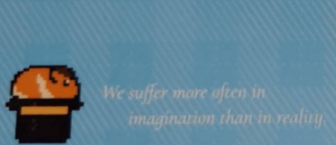

### 前言

　　沒想到 [BlogBlog 同樂會](https://blogblog.club/party/) 五月主題又在四月中偷跑了。本月主題是「[改變人生觀的一句話](https://eddielv.com/articles/a-sentence-changing-you/)」，由 [Eddie Lv](https://eddielv.com/) 主持。既然 BlogBlog 同樂會偷跑已是習俗，在這四月的投稿文章還沒寫完的同時，我做了一個大膽（？）的決定——就是先交五月的稿 XD

　　我大概是個非常喜歡「格言」的人。包括先前提過的[Actions speak louder than words](/thinking/actions-speak-louder-than-words/)，或者「Less is more」、「Don’t Think, Feel」，甚至是現在還打在通訊軟體上的「We've been gaining one good thing through losing another」，喜歡的「一句話」大概至少能排出「十句話」以上。但真說要改變了什麼人生觀，終究得是名片上的那兩行字，接下來就讓我娓娓道來。

　　這是我的「[BlogBlog 同樂會 - 2026 年 5 月](https://blogblog.club/party/)」的投稿文章，如果各位有自己的部落格，歡迎一起來參加！

　　（圖片擷取自[我的名片](/mood/my-name-cards/)）

　　

### 本文

　　我們在想像中受的苦多於現實中。

　　這是思多葛哲學家塞內卡（Seneca）所說的一段話（We suffer more often in imagination than in reality.）（雖然大家可能比較熟悉英文，但後來發現原文其實是拉丁文，所以英文其實不是「原文」），我將這句話連同馬可奧里略講的另一句話「人生的快樂取決於思想的品質」（The happiness of your life depends upon the quality of your thoughts）[印在了名片](/mood/my-name-cards/)上。

　　嗯，這兩句話有需要解釋什麼嗎？就是字面上的意思啊 XD。

　　如果這樣就全文完大概會被~~打死~~取消訂閱，只好趁這機會多聊聊包括思多葛哲學、佛教以及阿德勒心理學等綜合起來我認為一生受用的生活哲學。

　　我們的大腦就像一台永遠關不了機的電腦，如果不是在睡覺，就是在不停地思考。也因此，如果思考的品質出現問題，那麼就容易陷入焦慮。過多的資訊使我們焦慮，比較文化讓人焦慮，刻在人類原始基因內的「永遠不滿足」，使我們過度想像未來，只要達不到期望就產生焦慮。

　　但其實，這世上除了吃飽睡飽以外，都是人類自己想像出來的「虛構故事」。如果更廣義極端一點，「生命本身就是虛構故事」。佛教常說「離苦得樂」，聖嚴法師講道講到有一天他也會離世，底下信徒都表示「不行」的時候，他笑著回應：「你們還要我受這麼多的苦啊？」

　　聖嚴法師會這樣說，就因為佛教的「苦」定義廣泛，包括將整個人生（生老病死）看作「苦」的一部分。能對其一笑置之，才能正視生命的缺陷，得到超越「苦」的智慧。

　　就算不用如此嚴苛的定義看待，這世界上撇除掉生理（生存）的苦，其餘都是人類自行想像出來「虛構故事」。

　　有一個村民每天早上出門，都想要將沼澤內的爛泥給挖乾淨。但無論他如何挖，爛泥只會越來越多，不只填滿了他裝泥巴的桶子，還讓他全身都是爛泥。對他而言，每天的生活就是在與爛泥奮鬥，就算能住在遮風避雨的房子內，踏在平坦的道路上，那些挖不完的爛泥，也使他焦慮。

　　但很可惜這位仁兄從沒想過，沼澤就只是沼澤。不去挖的時候，它就靜靜在那裡而已。

　　阿德勒告訴我們一套非常有用的觀點，那就是「課題分離」。「別人如何看待我是他的課題，我如何看待自己，是自己的課題」。

　　許多公眾人物或網紅都有評價焦慮。明明這世界上支持自己的有數萬人，但黑粉的留言總能特別引起關注，甚至許多網紅樂得將這些人的留言截圖公審，我想也是同樣道理。斯多葛哲學和阿德勒心理學相同之處，就在於「別浪費時間在無法控制的事務上」，以及「痛苦不在於事物本身，而在於你對它的看法。而這個看法，隨時可以改變」[^1]。

　　「那個明星居然做如此不道德的事，真的很扯欸」

　　「天啊股市跌了一千點，世界要毀滅了」

　　「飛機居然誤點這麼久，害我少玩了一天」

　　我們不斷想像那些無法控制的事，把它當成我們的「苦惱」，最後任由它們吞噬自己。有時在意的人只是晚了幾個小時回訊息，卻已經在心裡演完整齣內心戲，認為對方不關心自己。明明盡了最大能力完成一件工作，只要主管一句負面評語，就能困擾自己一整天。

　　但社會資源早已溢出的今天，如果國家沒有戰亂或不是睡在公園，那麼已經比幾十年前的多數人類活得好上幾倍。

　　綜觀歷史，幾千年前的皇帝如馬可奧里略本人，多半也沒有我們現在活得舒適。那些明星八卦、股市漲跌、飛機誤點，相較於這宇宙的洪流，根本微不足道。當我們腦袋在想飛機誤點的同時，甚至沒有想過「人類能坐在一個鐵籠裡面飛在天空中」本質上就是一件奇蹟。

　　想像一下，3026 年的人們，抱怨著「天啊……去月球的火箭誤點了四小時……根本趕不上鳳飛飛（數位ＡＩ人格）首次月球演唱會了」。

　　不要笑，1026 年的人就大概是這樣看待我們在抱怨飛機誤點吧。[^2]

　　因此，如果能接受「我們在想像受的苦多於現實中」，那麼或許就能發現「只要改變『想像』，情緒就能自由，精神也得以自由」的事實。

　　一般人旅遊住宿時，大概會避開嘈雜的街道或者鐵路旁。但對於長期住在鐵軌旁的人，早已習慣火車經過時的聲音，如果沒有聽到平常該經過的火車經過，反而心神不寧，以為外面出了什麼事。

　　與其說是「習慣的力量」，其實只是「看事情角度」不同而已。

　　《美麗境界》的主角一生都在對抗因疾病而產生的幻覺。在片尾中他看著那些「幻覺」，說了類似的話：「那些幻覺其實一直都存在，只是我已經習慣不去理會它們了。」

　　不只是他，我想我們也是。因為「改變對事物的看法」是需要練習的。如果不是像泰國僧侶或聖嚴法師道行這樣高的人，焦慮就是人類的原始本能，我們總會被各種大大小小的虛構故事牽著鼻子走。就如同那些幻覺一樣。

　　焦慮總會找到機會湧上心頭，而我們能做的就是不要緊抓著不放。每當發生壞事、看到容易引起情緒的新聞時，「我們在想像中受的苦多於現實中」這句話，讓我身後有旁觀者在告訴我，這些都是自己無謂的「想像」而已。

　　人的想像力很珍貴，把它用在讓自己快樂且能獲得平靜的事上就好。

　　

### 後記

　　這篇一直想打的文章終於藉由 Blogblog 同樂會主題順水推舟打出來了！而且打得很快，只花半天的時間（大概是最近對自己 Blog 文章用字遣詞標準放寬的關係）！每當看到有人抱怨雞毛蒜皮的小事，都想介紹這樣的生活哲學給他但無從下手（而且如果直接這樣講，很像在說教，也沒人聽得進去），因此打好這篇文章以後就可以直接用貼的，太棒了（結果還是一樣） 🤣

　　其實我現實生活中有同樣心態的朋友非常稀少，但開始使用 Blog 之後已經看到好幾個朋友有著類似的觀點，也知道斯多葛哲學的好處，甚至也用信件交流過，超級開心。我想會願意在這年代寫個人 Blog 的人，思考果然有其相近之處吧？感謝各位朋友，讓我知道不是孤單一人 🥹

　　謝謝各位的閱讀，我們四月 BlogBlog 同樂會文章再見（咦）

[^1]: 出自 [Elvis Lin 這篇同樣在介紹斯多葛哲學的文章](https://vocus.cc/article/68c399dffd89780001566558)，我將它翻譯得更白話一點
[^2]: 飛機是由美國的萊特兄弟（Orville and Wilbur Wright）於1903年12月17日發明的。他們在北卡羅來納州的小鷹鎮（Kitty Hawk）成功試飛了第一架配備動力、可受控的穩定飛行器「飛行者一號」。（維基百科）