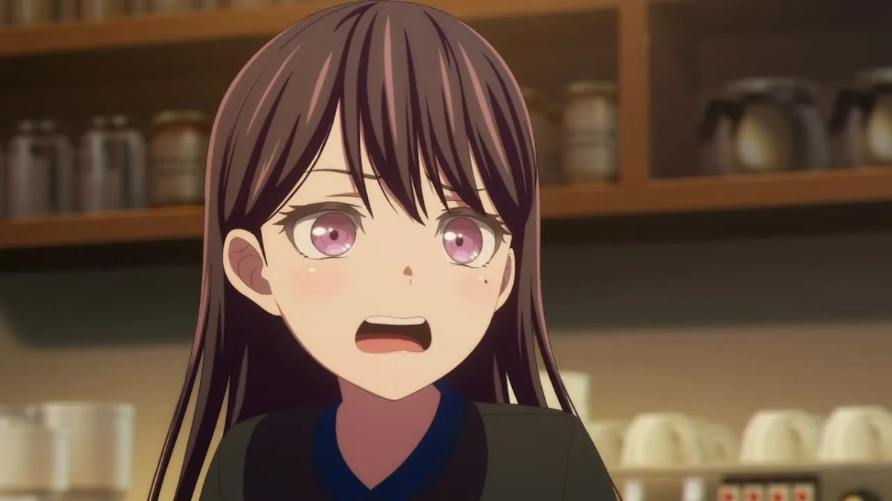

　　最近聽說有[留言區大戰](https://blog.ikukaroom.com/comment-yes-or-no/)這件事，但讓我驚訝的不是留言區本身，而是發現了像 ikuka 這樣的年輕朋友居然也寫出了「e-mail」的字眼。

> 我有問了我弟留言板的意見，他說要降低留言的門檻就是**不要輸入e-mail**。 —— *Ikuka*
> 

　　最一開始時，我就注意到 Wiwi 也是使用「E-mail」的寫法。第一次看到時，我還特地去查了一下，證明自己沒有想錯，以下是將「e-mail 還是 email」這句簡單的話丟給各大助理們後的結果：

　　Ｃ姓助理：「現在一般寫 **email**。**e-mail** 也不算錯，但比較舊，常見於較早期用法或少數保守風格。主流參考裡，Merriam-Webster 把 **email** 列為主詞形，並註明 **e-mail** 也是變體；Chicago 也明確表示現在偏好 **email**。」

　　Ｇ姓助理：「現代英文寫作中，email (不帶連字號) 是更常見、更符合趨勢的寫法。雖然 e-mail 曾是標準格式，但《牛津字典》與各大媒體（如《紐約時報》）已逐漸捨棄連字號，將其改為 email。兩者在商業上均可接受，但 email 顯得更簡潔現代。」

　　Ｃ姓二號助理：「推薦用 "Email"（全小寫或首字大寫），而不是 "E-mail"。原因：多數風格指南（包括 Chicago Manual of Style 最新版本）已改為 "email"，逐漸淘汰帶連字號的 "e-mail”，簡潔性：中文文本中用 "Email" 更簡潔流暢，避免了連字號的視覺打斷。」

　　雖然 email 的確是現在主流，但我認為 Wiwi 這樣的數位左派[^1]（？），在文章中將電子郵件寫成「E-mail」真是超級適合的，第一眼看到時真有一種舊時代的數位美感，非常有趣。但在 ikuka 的文章中看到時突然就變成了那張立希梗圖——

　　冷靜之後想想，可能是被 [Wiwi](http://wiwi.blog/) 影響的關係吧（胡亂猜測），影響力真是可怕（？）

### 後記

　　關於 Email 還是 E-mail，撇開報章雜誌的習慣，個人認真思考過一番，以下是我的推論：

　　當初只有手寫信件的年代，第一次出現了「非手寫」的 mail，於是人們在前面加上了「e」，泛指「electronic mail」。但隨著時代進步，各式各樣的「E」mail 紛紛出爐，例如廣義而言，手機的簡訊也是「E-mail」（雖然我知道英文會叫成 SMS，但 Short Message Service 照現代的科技發展又亂成了一團，Line 傳個訊息難道不也是某個字面上意思的 SMS？！），所以把 e-mail 變成一個真正的單字 email 可以解決一些語言邏輯上的問題，也就是透過「電子郵件系統」收發的郵件才得以叫做 email。

　　雖然我更喜歡 email 的簡潔，但我認為 e-mail 的確有種復古的美感，就如同現代流行音樂進入[終止式](https://nicechord.com/post/4-cadences/)時非得彈出 G7 → C 的屬七音而不是簡化的 G → C 一樣。（跳 Tone）

[^1]: 自己發明的詞，以形容在網路上推廣「數位自由」及「數位烏托邦」的實踐者，沒任何考據可以不用特別理會 🙏