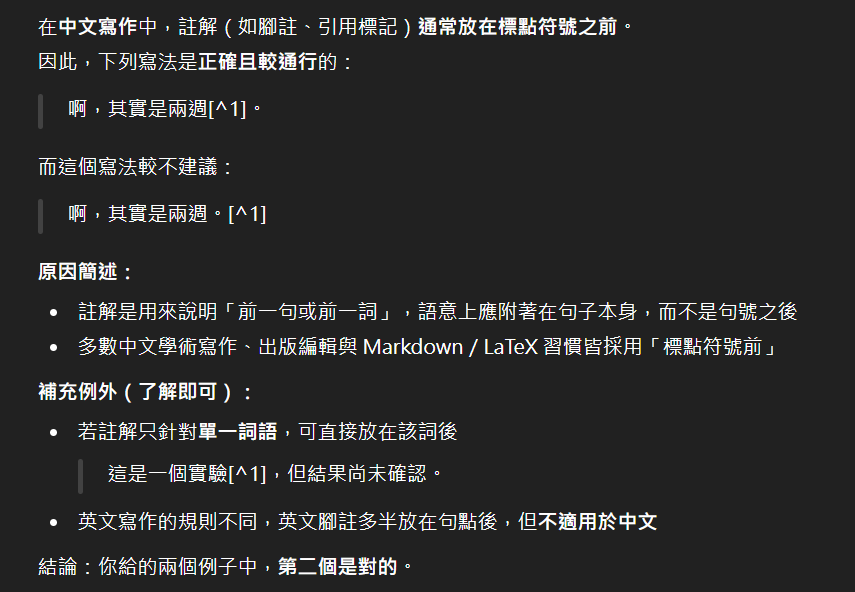

　　或許有人已經發現，我對文章排版有著異常的執著（Blog 爬到現在還沒有看過有人和我一樣開頭堅持空兩格）。但明明寫過碩士論文，還在 [Blog文章](/thinking/magicians/) 狂用 markdown 語法註腳的我，就在剛剛發現我居然不確定註腳到底要放在標點符號前面還後面，而且也沒有統一。

　　身為「排版正義戰士」（~~TJW：Typography Justice Warrior~~）居然這麼隨便，我很慚愧。於是趕緊把三位助理叫來問：

> 通常註腳要放在標點符號內還是外？
> 
> 啊，其實是兩週。[^1] 
> 
> 啊，其實是兩週[^1]。 
> 
> 哪個是對的？
> 

　　助理一號（GPT）的回答：

　　嗯，他給的原因我能接受。但為求保險起見，我繼續詢問助理二號（Gemini），沒想到它給了不同的答案：

　　助理二號不只給了以上的說法，還補充了「視覺上的考量」因素：如果將註解放在標點符號之外，在閱讀時，讀者會先讀完完整的句子再看到註解標記。如果放在標點之內，標點符號會被孤立在最後，視覺上顯得比較突兀。

　　這理由的確也有幾分道理，最後，我把問題丟給了助理三號（Claude），結果他支持了助理一號：

　　好了。如果是程式上的爭執，我大概已經讓助理們互相吵架了，但此時我知道停手是更正確的選擇，立刻自己搜尋了一下實務上學術論文是放在哪裡。

　　結論是——每個領域不同，期刊規範也不一樣。

　　嗯，於是我決定以後都緊跟在詞語之後，因為「邏輯上，註解是針對『兩週』這個資訊的補充說明，所以應該緊跟在被註釋的內容後面，然後才是句號收尾。」最能說服我。但先前已經寫好的文章就算了，馬有失蹄，TJW也有懶惰的時候。 XD